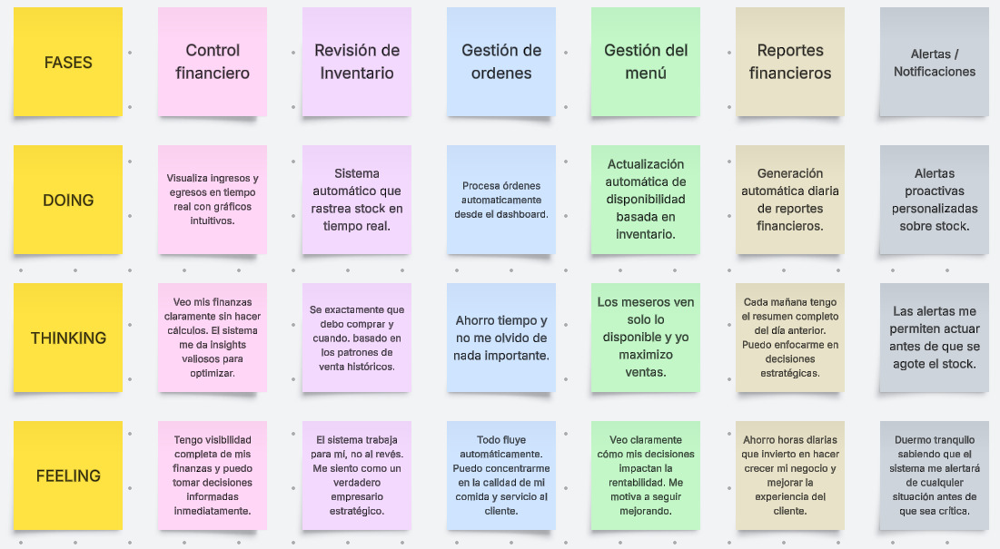
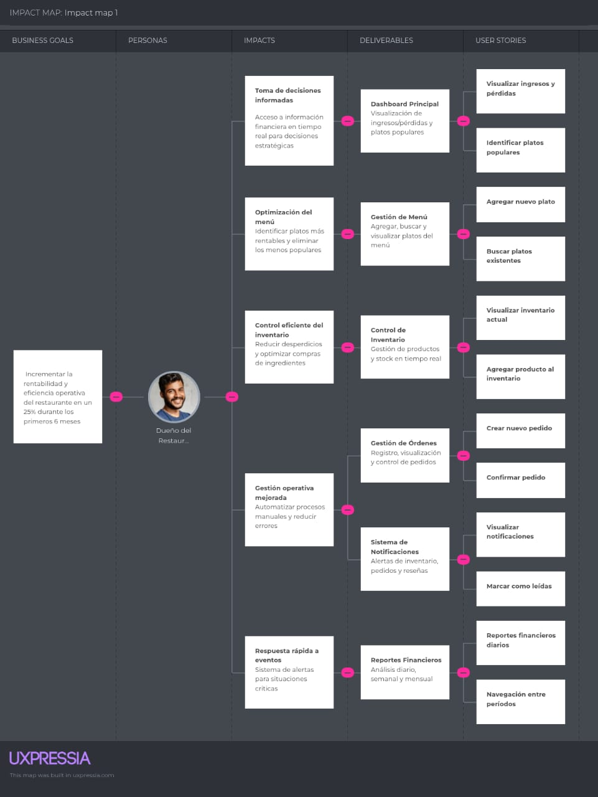

# Capítulo III: Requirements Specification
## 3.1 To-Be Scenario Mapping

Este es el escenario futuro (To-Be) que describe cómo los usuarios interactuarán con el sistema propuesto para satisfacer 
sus necesidades y alcanzar sus objetivos. El escenario To-Be se basa en la comprensión de los problemas actuales y las 
oportunidades de mejora identificadas en el escenario As-Is. El objetivo es proporcionar una visión clara de cómo el 
sistema debe funcionar para mejorar la experiencia del usuario y cumplir con los requisitos del negocio.

#### To-Be Scenario Mapping Dueño de Restaurante:

Esta es la descripción del escenario futuro (To-Be) para el dueño de un restaurante, después de implementar la solución 
tecnológica. Esta solución está diseñada para mejorar las operaciones del restaurante, aumentar la eficiencia, las
ventas y finanzas del negocio.

## 3.2 User Stories
## 3.3 Impact Map

## 3.4 Alcance
## 3.5 Product Backlog

| Orden | User Story Id | Título | Descripción | Story Points |
| :--- | :--- | :--- | :--- | :--- |
| 1 | US1 | Visualizar ingresos y pérdidas | Como dueño de restaurante quiero ver en el dashboard un resumen de mis ingresos y pérdidas para conocer rápidamente la situación financiera de mi negocio. | 8 |
| 2 | US18 | Visualización de Reportes Financieros Diarios | Como dueño de restaurante, quiero ver mis ingresos y gastos diarios en un dashboard centralizado para tomar decisiones informadas sobre el rendimiento financiero de mi negocio. | 8 |
| 3 | US19 | Navegación entre Períodos de Tiempo | Como dueño de restaurante, quiero poder alternar entre reportes diarios, semanales y mensuales para analizar tendencias en diferentes períodos de tiempo. | 8 |
| 4 | US20 | Análisis de Categorías de Gastos | Como dueño de restaurante, quiero visualizar el desglose de mis gastos por categorías para identificar áreas donde puedo optimizar costos. | 8 |
| 5 | US3 | Visualizar inventario actual | Como dueño de restaurante quiero ver una tabla con el stock, costo unitario y unidad de medida de cada producto para controlar el inventario de manera clara y rápida. | 5 |
| 6 | US11 | Visualizar órdenes existentes | Como dueño de restaurante quiero ver en una tabla las órdenes realizadas con su mesa, platos, precio total y fecha para llevar un control claro y rápido de los pedidos. | 5 |
| 7 | US2 | Identificar platos más populares | Como dueño de restaurante quiero ver un listado de mis platos más vendidos para saber cuáles son los más rentables y tomar decisiones sobre el menú. | 5 |
| 8 | US6 | Agregar Nuevo Plato | Como dueño de restaurante, quiero agregar nuevos platos al menú para mantener mi oferta actualizada y atractiva para los clientes. | 5 |
| 9 | US8 | Visualizar Información Completa del Menú | Como dueño de restaurante, quiero visualizar toda la información de mis platos (nombre, descripción, precio, ingredientes) en una tabla organizada para tener control total sobre mi menú. | 5 |
| 10 | US4 | Agregar un nuevo producto al inventario | Como dueño de restaurante quiero registrar un nuevo producto con su nombre, stock, costo unitario y unidad de medida para mantener actualizado mi inventario. | 3 |
| 11 | US12 | Registrar una nueva orden | Como dueño de restaurante quiero poder registrar una nueva orden desde el botón “New Order” para mantener actualizado el historial de pedidos. | 3 |
| 12 | US13 | Crear un nuevo pedido | Como dueño de restaurante, quiero poder registrar un nuevo pedido seleccionando mesa, platillo y fecha para llevar un control digital de las órdenes. | 3 |
| 13 | US16 | Calcular el total por platillo | Como dueño de restaurante quiero que el sistema calcule automáticamente el precio total de cada platillo para evitar errores de facturación manual. | 3 |
| 14 | US9 | Visualizar notificaciones | Como dueño de restaurante quiero ver todas las notificaciones en una lista para estar informado de pedidos, inventario y reseñas en tiempo real. | 3 |
| 15 | US5 | Validar campos al agregar producto | Como dueño de restaurante quiero que el sistema valide los campos obligatorios al agregar un producto para evitar errores en el registro del inventario. | 2 |
| 16 | US14 | Confirmar un pedido | Como dueño de restaurante quiero confirmar un pedido para que quede registrado en el sistema y se actualice el inventario. | 2 |
| 17 | US15 | Editar o eliminar un platillo de la orden | Como dueño de restaurante quiero editar o eliminar un platillo de la lista de detalles del pedido para corregir errores antes de confirmar la orden. | 2 |
| 18 | US17 | Cancelar creación de pedido | Como dueño de restaurante quiero poder cancelar la creación de un pedido para no guardar información incorrecta. | 2 |
| 19 | US7 | Buscar Platos Existentes | Como dueño de restaurante, quiero buscar platos específicos en mi menú para encontrar rápidamente la información que necesito actualizar. | 2 |
| 20 | US10 | Marcar las notificaciones como leídas | Como dueño de restaurante quiero poder marcar las notificaciones como leídas para mantener mi panel organizado. | 1 |
