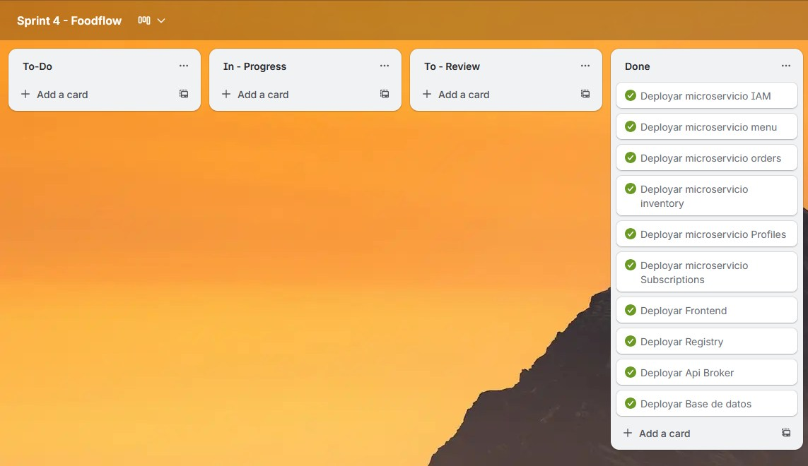

# Capítulo V: Product Implementation, Validation & Deployment

El presente capítulo documenta el proceso de **implementación, validación y despliegue** del sistema *FoodFlow*, una aplicación web de gestión financiera para restaurantes desarrollada bajo una arquitectura de **microservicios RESTful**.  
El proyecto fue construido aplicando metodologías ágiles, asegurando un producto usable, seguro y de buen desempeño.

## 5.1 Testing Suites & General Patterns

### 5.1.1 Backend Application Core Testing Suite

El backend de *FoodFlow* fue validado bajo el enfoque Behavior Driven Development (BDD), utilizando el lenguaje Gherkin para redactar escenarios de comportamiento legibles por humanos.  
Cada prueba se enfocó en verificar los criterios de aceptación de los **User Stories** implementados durante el Sprint 1.

### US03 - Visualizar inventario actual - gherkin:
Feature: Visualizar inventario actual
Como dueño de restaurante
Quiero ver una tabla con el stock, costo unitario y unidad de medida de cada producto
Para controlar el inventario de manera clara y rápida

Scenario: Visualización del inventario
Given que estoy en la sección "Inventory Management"
When ingreso al sistema
Then visualizo una tabla con los productos, su stock actual, costo unitario y unidad de medida

### US04 - Agregar un nuevo producto al inventario - gherkin:
Feature: Agregar nuevo producto al inventario
Como dueño de restaurante
Quiero registrar un nuevo producto con su nombre, stock, costo unitario y unidad de medida
Para mantener actualizado mi inventario

Scenario: Registro exitoso de producto
Given que estoy en la sección "Add New Product"
When ingreso el nombre del producto, stock, costo unitario y unidad de medida válidos
And presiono "Add Product"
Then el producto se añade a la tabla del inventario con los datos correctos
And aparece un mensaje de confirmación

### US05 - Validar campos al agregar producto - gherkin:
Feature: Validar campos al agregar producto
Como dueño de restaurante
Quiero que el sistema valide los campos obligatorios al agregar un producto
Para evitar errores en el registro del inventario

Scenario: Validación de campos obligatorios
Given que quiero registrar un producto
When dejo un campo vacío o ingreso un valor inválido
Then el sistema muestra un mensaje de error
And no permite guardar el producto hasta que la información sea correcta

### US09 - Visualizar órdenes existentes - gherkin:
Feature: Visualización de órdenes existentes
Como dueño de restaurante
Quiero ver las órdenes registradas con mesa, platos, precio total y fecha
Para llevar un control claro y rápido de las órdenes

Scenario: Visualización inicial de órdenes
Given que estoy en la sección "Orders"
When ingreso al sistema
Then visualizo una tabla con las órdenes registradas mostrando mesa, platos, precio total y fecha

### US10 - Calcular el total por plato - gherkin:
Feature: Calcular el total por plato
Como dueño de restaurante
Quiero que el sistema calcule automáticamente el precio total de cada plato
Para evitar errores de facturación manual

Scenario: Cálculo automático de total
Given que agrego un plato con precio unitario
When especifico la cantidad
Then el sistema calcula y muestra el precio total en la columna correspondiente

---

### 5.1.2 Pattern Based Backend Application(s)

La arquitectura del backend se diseñó siguiendo patrones de diseño estándar para mantener una estructura modular y desacoplada:

- **Repository Pattern:** abstrae la comunicación con la base de datos MySQL.
- **Service Layer Pattern:** centraliza la lógica de negocio.
- **Controller Pattern:** gestiona las rutas y la lógica de entrada/salida de datos.
- **DTO (Data Transfer Object):** facilita la transferencia segura de información.
- **Factory Pattern:** estandariza la creación de instancias de entidades.
- **Dependency Injection:** mejora la testabilidad y reduce el acoplamiento.

Estos patrones se aplicaron uniformemente en los microservicios de **inventario** y **órdenes**.

---

### 5.1.3 Pattern Based Custom Software Library

Durante la implementación se desarrolló una **librería interna reutilizable**, empleada por todos los microservicios, que incluye:

- Estructura estandarizada de respuestas JSON.
- Validación de entrada de datos.
- Middleware de autenticación basada en JWT.

Esto permitió mantener consistencia, minimizar redundancia y simplificar la depuración.

---

### 5.1.4 Framework Pattern Driven Refactoring Report

A lo largo del desarrollo se realizaron refactorizaciones orientadas por patrones del framework, priorizando legibilidad y mantenibilidad:

- Organización de controladores.
- Unificación de nomenclaturas REST (`/api/v1/`).
- Separación de configuraciones por entorno (`.env`).
- Simplificación de dependencias.
- Implementación de controladores globales de errores.

Cada cambio fue verificado mediante la ejecución completa de la suite BDD.

---

## 5.2 Software Configuration Management

### 5.2.1 Software Development Environment Configuration

| Tipo de Herramienta  | Herramienta Utilizada                         | Propósito                              |
|----------------------|-----------------------------------------------|----------------------------------------|
| IDE                  | Visual Studio Code / WebStorm / IntelliJ Idea | Desarrollo frontend y backend          |
| Control de versiones | Git + GitHub                                  | Versionamiento y trabajo colaborativo  |
| Testing              | Gherkin                                       | Acceptance Tests                       |
| API Client           | Postman / Swagger                             | Validación de endpoints                |
| Base de Datos        | MySQL (FreeSQL)                               | Almacenamiento persistente             |
| Documentación        | Swagger (OpenAPI)                             | Generación automática de documentación |
| Gestión de proyecto  | Trello                                        | Control ágil de tareas y User Stories  |

**Configuraciones adicionales:**  
El entorno de desarrollo utiliza variables `.env`, dependencias gestionadas con `npm`, y scripts configurados para automatizar pruebas y despliegues.

---

### 5.2.2 Source Code Management

El control de versiones se gestiona con **GitHub** bajo la metodología **GitFlow Workflow**, que define ramas estables y de desarrollo:

- `develop`: rama principal de desarrollo.
- `feature/*`: ramas por funcionalidad.

**Convenciones:**
- Semantic Versioning (`v1.0.0`, `v1.1.0`, etc.)
- Conventional Commits (`feat:`, `fix:`, `docs:`)

**Repositorio donde se realizó el código:** 
https://github.com/orgs/Biblioteca-de-Software/repositories
<br>

**Repositorio del proyecto actual:**
https://github.com/orgs/Fundamentos-de-Arquitectura/repositories

---

### 5.2.3 Source Code Style Guide & Conventions

Guías de estilo aplicadas:

- TypeScript Style Guide.
- Gherkin Conventions for Readable Specifications.
- Clases en camelCase
- Uso de inglés en todo el código.

---

### 5.2.4 Software Deployment Configuration

El despliegue de la landing page se realiza en Vercel

El despliegue del frontend se realiza en netlify

El despliegue del backend se realiza en **FreeSQL** para la base de datos.

**Pasos del pipeline:**
1. Build del proyecto (`npm run build`)
2. Ejecución de pruebas (`npm run test`)
3. Despliegue automatizado en entorno cloud
4. Validación mediante Postman y Swagger

<div style="page-break-after: always;"></div>

**Deployment Diagram (C4):**


<div style="page-break-after: always;"></div>

## 5.3 Microservices Implementation

### 5.3.1 Sprint 1

#### 5.3.1.1 Sprint Backlog 1

**Objetivo del Sprint:**  
Construir las funcionalidades básicas para la gestión de inventario y órdenes.

**Avance general:**  
En este sprint, el equipo se enfocó en construir las funcionalidades básicas para la gestión de inventario y órdenes. Todas las historias de usuario planificadas para estos dos módulos fueron implementadas, probadas y documentadas conforme a los criterios de aceptación.

**Herramienta utilizada:** Trello  
**URL del tablero:** 
https://trello.com/invite/b/68acc5a626e4614f12ee778f/ATTIb0400bfaba199996d200f641b89abc646996230A/arquitectura-de-software

<table>
  <thead>
    <tr>
      <th rowspan="2">User Story ID</th>
      <th rowspan="2">User Story</th>
      <th colspan="6">Work-Item / Task</th>
    </tr>
    <tr>
      <th>Task ID</th>
      <th>Título</th>
      <th>Descripción</th>
      <th>Estimación (h)</th>
      <th>Asignado a</th>
      <th>Estado</th>
    </tr>
  </thead>
  <tbody>
    <tr>
      <td rowspan="2">US06</td>
      <td rowspan="2">Agregar Nuevo Plato</td>
      <td>T6.1</td>
      <td>API: Agregar Plato</td>
      <td>Desarrollar el endpoint de POST para registrar un nuevo plato en la base de datos.</td>
      <td>8</td>
      <td>Paolo Torres</td>
      <td>To Do</td>
    </tr>
    <tr>
      <td>T6.2</td>
      <td>FE: Formulario Agregar Plato</td>
      <td>Crear el formulario en Angular para ingresar los datos del nuevo plato y conectar con el backend.</td>
      <td>12</td>
      <td>Paolo Torres</td>
      <td>To Do</td>
    </tr>
    <tr>
      <td rowspan="2">US07</td>
      <td rowspan="2">Buscar Platos Existentes</td>
      <td>T7.1</td>
      <td>FE: Campo de Búsqueda</td>
      <td>Implementar un campo de búsqueda en Angular para filtrar platos en tiempo real.</td>
      <td>6</td>
      <td>Romina Maita</td>
      <td>To Do</td>
    </tr>
    <tr>
      <td>T7.2</td>
      <td>BE: Endpoint de Búsqueda</td>
      <td>Desarrollar un endpoint en el backend para buscar platos por nombre.</td>
      <td>8</td>
      <td>Romina Maita</td>
      <td>To Do</td>
    </tr>
    <tr>
      <td rowspan="2">US08</td>
      <td rowspan="2">Visualizar Información Completa del Menú</td>
      <td>T8.1</td>
      <td>FE: Tabla de Platos</td>
      <td>Crear una tabla en Angular para mostrar la información completa de los platos.</td>
      <td>10</td>
      <td>Paolo Torres</td>
      <td>To Do</td>
    </tr>
    <tr>
      <td>T8.2</td>
      <td>BE: Endpoint de Listado</td>
      <td>Desarrollar un endpoint en el backend para obtener la información completa de los platos.</td>
      <td>8</td>
      <td>Paolo Torres</td>
      <td>To Do</td>
    </tr>
    <tr>
      <td rowspan="2">US11</td>
      <td rowspan="2">Visualización de Reportes Financieros Diarios</td>
      <td>T11.1</td>
      <td>FE: Dashboard de Reportes</td>
      <td>Crear un dashboard en Angular para mostrar los ingresos y gastos diarios.</td>
      <td>12</td>
      <td>Romina Maita</td>
      <td>To Do</td>
    </tr>
    <tr>
      <td>T11.2</td>
      <td>BE: Endpoint de Reportes</td>
      <td>Desarrollar un endpoint en el backend para calcular ingresos y gastos diarios.</td>
      <td>10</td>
      <td>Romina Maita</td>
      <td>To Do</td>
    </tr>
    <tr>
      <td rowspan="2">US12</td>
      <td rowspan="2">Navegación entre Períodos de Tiempo</td>
      <td>T12.1</td>
      <td>FE: Navegación de Períodos</td>
      <td>Implementar la funcionalidad de cambio entre vistas diarias, semanales y mensuales en el dashboard.</td>
      <td>8</td>
      <td>Paolo Torres</td>
      <td>To Do</td>
    </tr>
    <tr>
      <td>T12.2</td>
      <td>BE: Endpoint de Períodos</td>
      <td>Desarrollar un endpoint en el backend para obtener datos agregados por período.</td>
      <td>10</td>
      <td>Paolo Torres</td>
      <td>To Do</td>
    </tr>
    <tr>
      <td rowspan="2">US13</td>
      <td rowspan="2">Análisis de Categorías de Gastos</td>
      <td>T13.1</td>
      <td>FE: Visualización de Categorías</td>
      <td>Crear gráficos en Angular para mostrar el desglose de gastos por categoría.</td>
      <td>10</td>
      <td>Romina Maita</td>
      <td>To Do</td>
    </tr>
    <tr>
      <td>T13.2</td>
      <td>BE: Endpoint de Categorías</td>
      <td>Desarrollar un endpoint en el backend para calcular los gastos por categoría.</td>
      <td>8</td>
      <td>Romina Maita</td>
      <td>To Do</td>
    </tr>
  </tbody>
</table>

<div style="page-break-after: always;"></div>

#### 5.3.1.2 Development Evidence for Sprint Review

| Repository          | Branch                       | Commit ID | Commit Message                                    | Commit Message Body                                              | Committed on |
|---------------------|------------------------------|-----------|---------------------------------------------------|------------------------------------------------------------------|--------------|
| `Inventory Service` | `feature/inventory-module`   | `c19ad45` | `feat: implement inventory CRUD operations`       | Added controller, services, and models for inventory management. | 02/09/2025   |
| `Orders Service`    | `feature/orders-module`      | `d22ce35` | `feat: add order creation and confirmation`       | Implemented endpoints for creating and confirming orders.        | 03/09/2025   |
| `Inventory Service` | `fix/stock-update`           | `e33de12` | `fix: correct stock update on order confirmation` | Ensured inventory stock is correctly updated after an order.     | 04/09/2025   |
| `Orders Service`    | `refactor/order-calculation` | `f42bd73` | `refactor: improve order total calculation`       | Optimized the logic for calculating order totals.                | 04/09/2025   |

---

#### 5.3.1.3 Testing Suite Evidence for Sprint Review

Las pruebas BDD se desarrollaron con **Gherkin** para las User Stories implementadas.  
A continuación se presentan los archivos `.feature` correspondientes:

- US03 - Visualizar Inventario Actual

```Feature: Visualizar Inventario Actual
  Como dueño de restaurante
  Quiero ver una tabla con el stock, costo unitario y unidad de medida de cada producto
  Para controlar el inventario de manera clara y rápida

  Scenario: Visualización de la tabla de inventario
    Given que tengo productos registrados en mi inventario
    When navego a la sección "Inventory Management"
    Then debo ver una tabla con el listado de todos los productos
    And la tabla debe mostrar las columnas: Producto, Stock Actual, Costo Unitario y Unidad de Medida
```

- US04 - Agregar Nuevo Producto al Inventario

```Feature: Agregar Nuevo Producto al Inventario
  Como dueño de restaurante
  Quiero registrar un nuevo producto con sus datos
  Para mantener actualizado mi inventario

  Scenario: Registro exitoso de producto
    Given que estoy en la sección "Add New Product"
    When ingreso un Nombre, Stock (numérico), Costo Unitario (numérico) y Unidad de Medida válidos
    And presiono el botón "Add Product"
    Then el nuevo producto se añade a la tabla del inventario
    And veo un mensaje de confirmación "Producto añadido exitosamente"
```

- US05 - Validar Campos al Agregar Producto

```Feature: Validar Campos al Agregar Producto
  Como dueño de restaurante
  Quiero que el sistema valide los campos obligatorios y de formato
  Para evitar errores en el registro del inventario

  Scenario: Intento de registro con datos incompletos o inválidos
    Given que estoy en el formulario para registrar un nuevo producto
    When dejo el campo "Costo Unitario" vacío o ingreso texto en lugar de un número
    And presiono el botón "Add Product"
    Then el sistema muestra un mensaje de error específico junto al campo
    And el producto no se guarda en el inventario
```

- US09 - Visualización y Control de Órdenes Registradas

```Feature: Visualización y Control de Órdenes Registradas
  Como dueño de restaurante
  Quiero ver las órdenes registradas con sus detalles clave
  Para llevar un control claro y rápido de los órdenes

  Scenario: Visualización inicial de órdenes en la tabla
    Given que tengo órdenes registradas en el sistema
    When navego a la sección "Orders"
    Then debo ver una tabla con las órdenes
    And la tabla muestra las columnas: Mesa, Platos, Precio Total y Fecha
```

- US10 - Cálculo Automático del Total de Plato

```Feature: Cálculo Automático del Total de Plato
  Como dueño de restaurante
  Quiero que el sistema calcule automáticamente el precio total de cada plato
  Para evitar errores de facturación manual

  Scenario: Cálculo de total basado en cantidad
    Given que he agregado el plato "Hamburguesa" con un Precio Unitario de $10.00 al detalle de la orden
    When cambio la Cantidad de 1 a 3
    Then el sistema actualiza automáticamente el campo "Precio Total" a $30.00
```


<div style="page-break-after: always;"></div>

#### 5.3.1.4 Execution Evidence for Sprint Review

Durante el Sprint 1 se ejecutaron las pruebas de los módulos desarrollados en el backend y frontend, verificando la correcta interacción entre los servicios y la interfaz de usuario.  
La ejecución de los escenarios Gherkin se realizó utilizando la metodología **BDD (Behavior Driven Development)**, a través de los `.feature files` definidos para cada historia de usuario implementada.

Los resultados de la ejecución validaron la correcta respuesta de los endpoints RESTful del backend y su coherencia con las funcionalidades del frontend.  
A continuación se resume la evidencia obtenida:

| Módulo        | Endpoint principal                              | Resultado de ejecución                                  | Estado |
|---------------|-------------------------------------------------|---------------------------------------------------------|--------|
| Inventario    | `/api/v1/inventory`                             | Listado, registro y validación de productos             | Passed |
| Órdenes       | `/api/v1/orders`                                | Registro, visualización y confirmación de órdenes       | Passed |

<div style="page-break-after: always;"></div>

### Orders:


### Inventory


<div style="page-break-after: always;"></div>

#### 5.3.1.5 Microservices Documentation Evidence for Sprint Review

La aplicación *FoodFlow* fue desarrollada bajo una arquitectura **basada en microservicios RESTful**, donde cada dominio del negocio se implementa de forma independiente para asegurar modularidad, escalabilidad y mantenibilidad del sistema.

En este sprint, el foco estuvo en los siguientes microservicios:

| Microservicio         | Descripción funcional                                              | Endpoints principales                          |
|-----------------------|--------------------------------------------------------------------|------------------------------------------------|
| **Inventory Service** | Control de inventario, stock, y validaciones.                      | `/api/v1/inventory`, `/api/v1/inventory/{id}`  |
| **Orders Service**    | Gestión de órdenes, confirmaciones y cálculos totales.             | `/api/v1/orders`, `/api/v1/orders/{id}`        |

##### Documentación API:
Toda la documentación del backend fue generada automáticamente con **Swagger (OpenAPI)**, donde se describen los endpoints, modelos de datos y respuestas HTTP.


##### Integración:
Cada microservicio será desplegado de manera independiente, comunicándose entre sí mediante HTTP.  
El gateway unificará las peticiones hacia los servicios de dominio y gestionará los encabezados de autenticación JWT.

---

#### 5.3.1.6 Software Deployment Evidence for Sprint Review

El despliegue de *FoodFlow* se realizó en un entorno cloud utilizando un servidor FreeSQL para la base de datos relacional MySQL, y un entorno web para el frontend.  
Se implementó un pipeline de despliegue siguiendo el flujo GitFlow, con integración continua y versionamiento controlado.


##### Configuración general de despliegue:

| Componente            | Tecnología            | Descripción                                         |
|-----------------------|-----------------------|-----------------------------------------------------|
| **Backend**           | Java Spring Boot      | Desplegado como conjunto de microservicios RESTful. |
| **Frontend**          | Angular + Material UI | Dashboard interactivo con reportes y gráficos.      |
| **Base de Datos**     | MySQL                 | Gestión de datos financieros, platos e inventarios. |
| **Documentación API** | Swagger (OpenAPI)     | Publicación de especificaciones REST.               |

##### Proceso de despliegue:

1. **Commit en rama `develop`** → validación de tests automáticos.
2. **Verificación** mediante consultas de endpoints desde Postman.

**Evidencia visual del despliegue:**
**Backend desplegado en FreeSQL:** 
<br>

**Frontend desplegado en netlify:** https://deplokeep.netlify.app/pages/login-owner

<br>

**Landing Page desplegada en Vercel:** https://landing-page-silk-nine-71.vercel.app/

---

#### 5.3.1.7 Team Collaboration Insights during Sprint

Durante el Sprint 1, el equipo de desarrollo mantuvo una comunicación constante utilizando herramientas ágiles y colaborativas.  
La metodología aplicada fue Scrum, con reuniones de seguimiento semanales para la revisión del progreso y resolución de bloqueos.

##### Herramientas utilizadas:
- **Trello:** gestión del backlog, tareas y definición del flujo Kanban.
- **GitHub:** control de versiones y revisión de código mediante Pull Requests.
- **Discord / WhatsApp:** reuniones de planificación, retrospectiva y revisión de sprint.

##### GitHub Insights:


---

#### 5.3.1.8 Kanban Board

Durante el Sprint 1 se empleó un tablero Kanban en **Trello** para gestionar las historias de usuario, priorizar tareas y monitorear el avance del sprint.

El tablero se estructuró con las siguientes columnas:
- **To Do:** Tareas seleccionadas para el sprint actual.
- **Doing** Tareas en desarrollo.
- **Done:** Historias completadas y verificadas.

**URL del tablero de Trello:**
https://trello.com/invite/b/68acc5a626e4614f12ee778f/ATTIb0400bfaba199996d200f641b89abc646996230A/arquitectura-de-software

**Captura del tablero Kanban:**


---

 **Conclusión del Sprint 1:**  
 El equipo completó con éxito la implementación de los módulos de Inventario y Órdenes, cumpliendo con los objetivos de desarrollo, validación e integración de los microservicios correspondientes. Las funcionalidades de Dashboard, Reportes y Menú quedan planificadas para futuros sprints.


<div style="page-break-after: always;"></div>

### 5.3.2 Sprint 2

#### 5.3.2.1 Sprint Backlog 2

**Objetivo del Sprint:**  
Construir las funcionalidades básicas para la gestión de subscriptions, IAM y profiles e integrar orders e inventory con Apache Kafka..

**Avance general:**  
En este sprint, el equipo se enfocó en construir las funcionalidades básicas para la gestión de subscriptions, IAM y profiles e integración de inventory y orders con Apache Kafka. Todas las historias de usuario planificadas para estos dos módulos fueron implementadas, probadas y documentadas conforme a los criterios de aceptación.

**Herramienta utilizada:** Trello  
**URL del tablero:** https://trello.com/invite/b/6908f5bbfb6116c0fb9f808d/ATTI6ffb173398dc4a8f401d2e79128763caA0B1AA18/sprint-2-foodflow


| User Story Id | Título                                  | Descripción                                                                                                                                                                      | Estimado (horas) | Encargado          |
|:--------------|:----------------------------------------|:---------------------------------------------------------------------------------------------------------------------------------------------------------------------------------|:-----------------|:-------------------|
| **US03**      | Visualizar inventario actual            | Como dueño de restaurante quiero ver una tabla con el stock, costo unitario y unidad de medida de cada producto para controlar el inventario de manera clara y rápida.           | 6                | Werner Lang        |
| **US04**      | Agregar un nuevo producto al inventario | Como dueño de restaurante quiero registrar un nuevo producto con su nombre, stock, costo unitario y unidad de medida para mantener actualizado mi inventario.                    | 5                | Werner Lang        |
| **US05**      | Validar campos al agregar producto      | Como dueño de restaurante quiero que el sistema valide los campos obligatorios al agregar un producto para evitar errores en el registro del inventario.                         | 3                | Werner Lang        |
| **US09**      | Visualizar órdenes existentes           | Como dueño de restaurante quiero ver en una tabla las órdenes realizadas con su mesa, platos, precio total y fecha para llevar un control claro y rápido de los órdenes.         | 6                | Werner Lang        |
| **US14**      | Visualizar Planes de Suscripción        | Como dueño de restaurante, quiero ver los diferentes planes de suscripción disponibles (gratuito, estándar y premium) para conocer las opciones y beneficios antes de decidirme. | 5                | Paolo Torres       |
| **US15**      | Suscribirse al Plan Premium             | Como dueño de restaurante, quiero poder suscribirme al plan premium para acceder a funcionalidades avanzadas que mejoren la gestión de mi negocio.                               | 5                | Paolo Torres       |
| **US16**      | Cancelar Suscripción                    | Como dueño de restaurante, quiero poder cancelar mi suscripción de pago para dejar de usar el plan premium cuando ya no lo considere necesario.                                  | 4                | Paolo Torres       |
| **US17**      | Visualizar Perfil de Usuario            | Como dueño de restaurante, quiero ver mi información personal y detalles de cuenta en la sección “Profile” para poder revisar mis datos registrados.                             | 4                | Romina Maita       |
| **US18**      | Actualizar Datos del Perfil             | Como dueño de restaurante, quiero actualizar mi información personal (nombre, correo, contraseña, imagen de perfil) para mantener mi cuenta al día.                              | 5                | Romina Maita       |
| **US19**      | Iniciar Sesión                          | Como dueño de restaurante, quiero iniciar sesión en el sistema con mi correo y contraseña para acceder de forma segura a mis datos y funcionalidades.                            | 6                | Romina Maita       |
| **US20**      | Crear Cuenta Nueva                      | Como dueño de restaurante, quiero crear una cuenta ingresando mis datos básicos (nombre, correo, contraseña) para comenzar a usar el sistema.                                    | 6                | Romina Maita       |

---

#### 5.3.2.2 Development Evidence for Sprint Review

##### 5.3.2.2.1 Subscriptions Service

| Repository             | Branch                       | Commit ID | Commit Message                                                          | Commit Message Body                                                          | Committed on |
|------------------------|------------------------------|-----------|-------------------------------------------------------------------------|------------------------------------------------------------------------------|--------------|
| `subscription-service` | `develop`                    | `a1b2c3d` | `Fix: typo`                                                             | Corrección menor de error tipográfico en el código.                          | 25/10/2025   |
| `subscription-service` | `develop`                    | `b2c3d4e` | `Subscription Service details`                                          | Añadidos detalles y mejoras en la configuración del servicio de suscripción. | 25/10/2025   |
| `subscription-service` | `develop`                    | `c3d4e5f` | `Merge pull request #5 from /testing`                                   | Integración de cambios desde la rama de pruebas.                             | 25/10/2025   |
| `subscription-service` | `testing`                    | `d4e5f6g` | `fix(domain): add jsonIgnoreProperties to avoid serialization problems` | Añadido `@JsonIgnoreProperties` para evitar problemas de serialización.      | 24/10/2025   |
| `subscription-service` | `testing`                    | `e5f6g7h` | `fix: delete unnecessary dependency`                                    | Eliminada dependencia innecesaria del proyecto.                              | 24/10/2025   |
| `subscription-service` | `testing`                    | `f6g7h8i` | `feat(test): add pom and app props`                                     | Agregados archivos `pom.xml` y `application.properties` para pruebas.        | 23/10/2025   |
| `subscription-service` | `develop`                    | `g7h8i9j` | `Merge pull request #4 from feature/add-interfaces`                     | Combinada la rama con la capa de interfaces.                                 | 23/10/2025   |
| `subscription-service` | `feature/add-interfaces`     | `h8i9j0k` | `feat(interfaces): add controller`                                      | Implementado controlador principal para gestión de suscripciones.            | 23/10/2025   |
| `subscription-service` | `develop`                    | `i9j0k1l` | `Merge pull request #3 from feature/add-infrastructure`                 | Fusionada la capa de infraestructura.                                        | 23/10/2025   |
| `subscription-service` | `develop`                    | `j0k1l2m` | `Merge pull request #2 from feature/add-application`                    | Integrada capa de aplicación.                                                | 23/10/2025   |
| `subscription-service` | `feature/add-infrastructure` | `k1l2m3n` | `feat(infrastructure): add infrastructure layer`                        | Añadida la capa de infraestructura al proyecto.                              | 23/10/2025   |
| `subscription-service` | `feature/add-application`    | `l2m3n4o` | `feat(application): add SubscriptionService todo infrastructure`        | Creado `SubscriptionService` pendiente de integración con infraestructura.   | 23/10/2025   |
| `subscription-service` | `develop`                    | `m3n4o5p` | `Merge pull request #1 from feature/add-domain`                         | Añadida la capa de dominio al proyecto.                                      | 23/10/2025   |
| `subscription-service` | `feature/add-domain`         | `n4o5p6q` | `feat(application): add dtos`                                           | Creación de los DTOs para comunicación entre capas.                          | 23/10/2025   |
| `subscription-service` | `feature/add-domain`         | `o5p6q7r` | `feat(model): add domain service`                                       | Añadido servicio de dominio base.                                            | 23/10/2025   |
| `subscription-service` | `feature/add-domain`         | `p6q7r8s` | `feat(model): add domain repositories`                                  | Implementación inicial de repositorios de dominio.                           | 23/10/2025   |
| `subscription-service` | `feature/add-domain`         | `q7r8s9t` | `feat(model): add domain model entities`                                | Definidas entidades principales del modelo de dominio.                       | 23/10/2025   |
| `subscription-service` | `main`                       | `r8s9t0u` | `Initial commit`                                                        | Configuración inicial del repositorio.                                       | 23/10/2025   |
| `subscription-service` | `main`                       | `s9t0u1v` | `initial commit`                                                        | Versión preliminar del repositorio base.                                     | 23/10/2025   |

##### 5.3.2.2.2 IAM Service

| Repository         | Branch | Commit ID | Commit Message          | Commit Message Body                                       | Committed on |
|--------------------|--------|-----------|-------------------------|-----------------------------------------------------------|--------------|
| `IAM-microservice` | `main` | `t1u2v3w` | `chore: initial commit` | Commit inicial. Adición de todo el microservicio a Github | 26/10/2025   |

##### 5.3.2.2.3 Inventory Service

| Repository          | Branch | Commit ID | Commit Message                                                                            | Commit Message Body                                                                        | Committed on |
|---------------------|--------|-----------|-------------------------------------------------------------------------------------------|--------------------------------------------------------------------------------------------|--------------|
| `inventory-service` | `main` | `u1v2w3x` | `fix: typo and unnecessary comments`                                                      | Corrección de errores tipográficos y eliminación de comentarios innecesarios en el código. | 29/10/2025   |
| `inventory-service` | `main` | `v2w3x4y` | `fix: typo`                                                                               | Ajuste menor de redacción en el código fuente.                                             | 29/10/2025   |
| `inventory-service` | `main` | `w3x4y5z` | `fix: typo`                                                                               | Corrección de error tipográfico en una clase o archivo específico.                         | 29/10/2025   |
| `inventory-service` | `main` | `x4y5z6a` | `fix: delete docker compose that was for testing message broker`                          | Eliminado archivo Docker Compose usado únicamente para pruebas con el message broker.      | 29/10/2025   |
| `inventory-service` | `main` | `y5z6a7b` | `feat(inventory): add docker compose for kafka and change application variable for ports` | Añadido archivo Docker Compose para Kafka y ajustes de puertos en variables de aplicación. | 24/10/2025   |
| `inventory-service` | `main` | `z6a7b8c` | `feat(inventory): change variables for it to work with broker`                            | Modificadas variables de entorno para compatibilidad con el message broker.                | 24/10/2025   |
| `inventory-service` | `main` | `a7b8c9d` | `feat(inventory): add kafka configuration`                                                | Configuración inicial de Kafka en el servicio de inventario.                               | 24/10/2025   |
| `inventory-service` | `main` | `b8c9d0e` | `feat(inventory): add dependencies for broker and events on domain`                       | Agregadas dependencias necesarias para manejar eventos y comunicación con el broker.       | 24/10/2025   |
| `inventory-service` | `main` | `c9d0e1f` | `chore: Initial commit`                                                                   | Commit inicial del repositorio.                                                            | 08/10/2025   |

##### 5.3.2.2.4 Orders Service

| Repository       | Branch | Commit ID | Commit Message                                               | Commit Message Body                                                                | Committed on |
|------------------|--------|-----------|--------------------------------------------------------------|------------------------------------------------------------------------------------|--------------|
| `orders-service` | `main` | `d0e1f2g` | `Merge pull request #1 from Fundamentos-de-Arquitectura/dev` | Integración de los cambios de la rama `dev` al main del proyecto.                  | 29/10/2025   |
| `orders-service` | `dev`  | `e1f2g3h` | `feat: modify service impl to publish order event to kafka`  | Modificada la implementación del servicio para publicar eventos de orden en Kafka. | 26/10/2025   |
| `orders-service` | `dev`  | `f2g3h4i` | `feat: add event producer`                                   | Añadido productor de eventos para enviar mensajes al broker Kafka.                 | 26/10/2025   |
| `orders-service` | `dev`  | `g3h4i5j` | `feat: add kafka configuration`                              | Configurada la conexión y propiedades de Kafka en el servicio.                     | 26/10/2025   |
| `orders-service` | `dev`  | `h4i5j6k` | `feat: add events`                                           | Creación de clases y estructuras para eventos de dominio.                          | 26/10/2025   |
| `orders-service` | `dev`  | `i5j6k7l` | `feat: add poml and application for kafka`                   | Añadidos `pom.xml` y propiedades de aplicación para Kafka.                         | 26/10/2025   |
| `orders-service` | `dev`  | `j6k7l8m` | `fix: typo`                                                  | Corrección de error tipográfico menor.                                             | 08/10/2025   |
| `orders-service` | `main` | `k7l8m9n` | `chore: initial commit`                                      | Commit inicial del proyecto.                                                       | 08/10/2025   |


##### 5.3.2.2.5 Profiles Service

| Repository         | Branch | Commit ID | Commit Message                                                                   | Commit Message Body                              | Committed on |
|--------------------|--------|-----------|----------------------------------------------------------------------------------|--------------------------------------------------|--------------|
| `profiles-service` | `main` | `l9m0n1o` | `feat: initialize profiles microservice with basic structure and configurations` | Servicio implementado, push directo desde local. | 30/10/2025   |

---

#### 5.3.2.3 Testing Suite Evidence for Sprint Review

Las pruebas BDD se desarrollaron con **Gherkin** para las User Stories implementadas.  
A continuación se presentan los archivos `.feature` correspondientes:

## US03 - Visualizar Inventario Actual
```gherkin
Feature: Visualizar Inventario Actual
  Como dueño de restaurante
  Quiero ver una tabla con el stock, costo unitario y unidad de medida de cada producto
  Para controlar el inventario de manera clara y rápida

  Scenario: Visualización de la tabla de inventario
    Given que tengo productos registrados en mi inventario
    When navego a la sección "Inventory Management"
    Then debo ver una tabla con el listado de todos los productos
    And la tabla debe mostrar las columnas: Producto, Stock Actual, Costo Unitario y Unidad de Medida
```

## US04 - Agregar Nuevo Producto al Inventario
```gherkin
Feature: Agregar Nuevo Producto al Inventario
  Como dueño de restaurante
  Quiero registrar un nuevo producto con sus datos
  Para mantener actualizado mi inventario

  Scenario: Registro exitoso de producto
    Given que estoy en la sección "Add New Product"
    When ingreso un Nombre, Stock (numérico), Costo Unitario (numérico) y Unidad de Medida válidos
    And presiono el botón "Add Product"
    Then el nuevo producto se añade a la tabla del inventario
    And veo un mensaje de confirmación "Producto añadido exitosamente"
```

## US05 - Validar Campos al Agregar Producto
```gherkin
Feature: Validar Campos al Agregar Producto
  Como dueño de restaurante
  Quiero que el sistema valide los campos obligatorios y de formato
  Para evitar errores en el registro del inventario

  Scenario: Intento de registro con datos incompletos o inválidos
    Given que estoy en el formulario para registrar un nuevo producto
    When dejo el campo "Costo Unitario" vacío o ingreso texto en lugar de un número
    And presiono el botón "Add Product"
    Then el sistema muestra un mensaje de error específico junto al campo
    And el producto no se guarda en el inventario
```

## US09 - Visualizar Órdenes Existentes
```gherkin
Feature: Visualizar Órdenes Existentes
  Como dueño de restaurante
  Quiero ver las órdenes registradas con sus detalles clave
  Para llevar un control claro y rápido de las órdenes

  Scenario: Visualización inicial de órdenes en la tabla
    Given que tengo órdenes registradas en el sistema
    When navego a la sección "Orders"
    Then debo ver una tabla con las órdenes
    And la tabla muestra las columnas: Mesa, Platos, Precio Total y Fecha
```

## US14 - Visualizar Planes de Suscripción
```gherkin
Feature: Visualizar Planes de Suscripción
  Como dueño de restaurante
  Quiero ver los diferentes planes de suscripción disponibles
  Para conocer las opciones y beneficios antes de decidirme

  Scenario: Mostrar lista de planes disponibles
    Given que accedo a la sección "Subscriptions"
    When el sistema carga los datos de los planes
    Then debo ver una lista con los nombres, precios y beneficios de cada plan
    And los planes deben incluir: Gratuito, Estándar y Premium

  Scenario: Error al cargar planes
    Given que accedo a la sección "Subscriptions"
    When el servidor no responde correctamente
    Then debo ver un mensaje "No se pudieron cargar los planes. Intente nuevamente."
```

## US15 — Suscribirse al Plan Premium
```gherkin
Feature: Suscribirse al Plan Premium
  Como dueño de restaurante
  Quiero poder suscribirme al plan premium
  Para acceder a funcionalidades avanzadas de gestión

  Scenario: Suscripción exitosa
    Given que estoy en la sección "Subscriptions" y tengo un método de pago válido
    When selecciono el plan "Premium" y confirmo el pago
    Then el sistema activa mi suscripción premium
    And veo un mensaje de confirmación "Suscripción activada correctamente"

  Scenario: Error en el pago
    Given que estoy en la sección "Subscriptions"
    When intento suscribirme pero el método de pago es rechazado
    Then el sistema muestra un mensaje "Error en la transacción, intente nuevamente"
```

## US16 - Cancelar Suscripción
```gherkin
Feature: Cancelar Suscripción
  Como dueño de restaurante
  Quiero cancelar mi suscripción premium
  Para dejar de usar el plan de pago cuando ya no lo necesite

  Scenario: Cancelación exitosa de suscripción
    Given que tengo una suscripción premium activa
    When hago clic en "Cancel Subscription" y confirmo la acción
    Then el sistema cambia mi plan a "Free Plan"
    And muestra un mensaje de confirmación "Suscripción cancelada correctamente"

  Scenario: Cancelación abortada por el usuario
    Given que tengo una suscripción premium activa
    When hago clic en "Cancel Subscription" pero cierro el diálogo sin confirmar
    Then la suscripción permanece activa
```

## US17 - Visualizar Perfil de Usuario
```gherkin
Feature: Visualizar Perfil de Usuario
  Como dueño de restaurante
  Quiero ver mi información personal y detalles de cuenta
  Para revisar mis datos registrados

  Scenario: Mostrar datos del perfil
    Given que estoy autenticado en el sistema
    When navego a la sección "Profile"
    Then debo ver mi nombre, correo e imagen de perfil
    And el plan de suscripción actual

  Scenario: Error al cargar perfil
    Given que intento acceder a la sección "Profile"
    When ocurre un error al recuperar la información
    Then el sistema muestra un mensaje "No se pudo cargar el perfil. Reintente."
```

## US18 - Actualizar Datos del Perfil
```gherkin
Feature: Actualizar Datos del Perfil
  Como dueño de restaurante
  Quiero editar mi información personal y contraseña
  Para mantener mis datos actualizados

  Scenario: Actualización exitosa
    Given que estoy en la sección "Profile"
    When modifico mi nombre o correo y presiono "Guardar cambios"
    Then el sistema actualiza mis datos
    And muestra un mensaje "Cambios guardados correctamente"

  Scenario: Validación de campos inválidos
    Given que estoy editando mis datos
    When ingreso un correo con formato incorrecto o dejo un campo vacío
    Then el sistema muestra mensajes de error bajo los campos correspondientes
```

## US19 - Iniciar Sesión
```gherkin
Feature: Iniciar Sesión
  Como dueño de restaurante
  Quiero acceder al sistema con mi correo y contraseña
  Para ingresar de forma segura a mis funcionalidades

  Scenario: Inicio de sesión exitoso
    Given que tengo una cuenta registrada
    When ingreso mi correo y contraseña válidos y presiono "Login"
    Then el sistema me redirige al dashboard principal

  Scenario: Credenciales inválidas
    Given que ingreso una contraseña incorrecta
    When presiono "Login"
    Then el sistema muestra un mensaje "Credenciales inválidas"

  Scenario: Campos vacíos
    Given que intento iniciar sesión sin completar los campos
    When presiono "Login"
    Then el sistema muestra un mensaje "Complete todos los campos"
```

## US20 - Crear Cuenta Nueva
```gherkin
Feature: Crear Cuenta Nueva
  Como dueño de restaurante
  Quiero registrarme en el sistema con mis datos básicos
  Para comenzar a usar el sistema

  Scenario: Registro exitoso
    Given que estoy en la página de registro
    When ingreso un nombre, correo y contraseña válidos y presiono "Sign Up"
    Then el sistema crea mi cuenta
    And muestra un mensaje "Cuenta creada exitosamente"
    And me redirige a la página de inicio de sesión

  Scenario: Campos inválidos
    Given que intento registrarme con un correo en formato incorrecto o sin llenar todos los campos
    When presiono "Sign Up"
    Then el sistema muestra un mensaje de error "Por favor complete todos los campos correctamente"

  Scenario: Correo duplicado
    Given que intento crear una cuenta con un correo ya registrado
    When presiono "Sign Up"
    Then el sistema muestra un mensaje "El correo ingresado ya está en uso"
```

<div style="page-break-after: always;"></div>

#### 5.3.2.4 Execution Evidence for Sprint Review

Durante el Sprint 2 se ejecutaron las pruebas de los módulos desarrollados en el backend y frontend, verificando la correcta interacción entre los servicios y la interfaz de usuario.  
La ejecución de los escenarios Gherkin se realizó utilizando la metodología **BDD (Behavior Driven Development)**, a través de los `.feature files` definidos para cada historia de usuario implementada.

Los resultados de la ejecución validaron la correcta respuesta de los endpoints RESTful del backend y su coherencia con las funcionalidades del frontend.  
A continuación se resume la evidencia obtenida:

| Módulo        | Endpoint principal                           | Resultado de ejecución                            | Estado |
|---------------|----------------------------------------------|---------------------------------------------------|--------|
| Inventory     | `/api/v1/inventory`                          | Listado, registro y validación de productos       | Passed |
| Orders        | `/api/v1/orders`                             | Registro, visualización y confirmación de órdenes | Passed |
| Subscriptions | `/api/v1/subscriptions`                      | Gestión de suscripciones                          | Passed |
| Profiles      | `/api/v1/profiles`                           | Gestión de perfiles de usuario                    | Passed |
| IAM           | `/api/v1/accounts`, `/api/v1/authentication` | Gestión de autenticación de usuario               | Passed |


<div style="page-break-after: always;"></div>

### Orders:


<div style="page-break-after: always;"></div>

### Inventory


<div style="page-break-after: always;"></div>

### Subscriptions


<div style="page-break-after: always;"></div>

### Profiles


<div style="page-break-after: always;"></div>

### IAM 


<div style="page-break-after: always;"></div>

#### 5.3.2.5 Microservices Documentation Evidence for Sprint Review

La aplicación *FoodFlow* fue desarrollada bajo una arquitectura **basada en microservicios RESTful**, donde cada dominio del negocio se implementa de forma independiente para asegurar modularidad, escalabilidad y mantenibilidad del sistema.

En este sprint, el foco estuvo en los siguientes microservicios:

| Microservicio             | Descripción funcional                                                       | Endpoints principales                                                                                                                             |
|---------------------------|-----------------------------------------------------------------------------|---------------------------------------------------------------------------------------------------------------------------------------------------|
| **Inventory Service**     | Control de inventario, stock, y validaciones.                               | `/api/v1/inventory`, `/api/v1/inventory/{id}`                                                                                                     |
| **Orders Service**        | Gestión de órdenes, confirmaciones y cálculos totales.                      | `/api/v1/orders`, `/api/v1/orders/{id}`                                                                                                           |
| **Subscriptions Service** | Gestión de suscripciones, suscripciones activas y suscripciones canceladas. | `/api/v1/subscriptions`, `/api/v1/subscriptions/{id}`, `/api/v1/subscriptions/plans`, `/api/v1/subscriptions/{userId}`                            |
| **Profiles Service**      | Gestión de perfiles de usuario, creación y actualización.                   | `/api/v1/profiles`, `/api/v1/profiles/{profilesId}`                                                                                               |
| **IAM Service**           | Gestión de autenticación de usuario, registro e inicio de sesión.           | `/api/v1/accounts`, `/api/v1/accounts/{accountsId}`, `/api/v1/authentication`, `/api/v1/authentication/sign-in`, `/api/v1/authentication/sign-up` |

##### Documentación API:
Toda la documentación del backend fue generada automáticamente con **Swagger (OpenAPI)**, donde se describen los endpoints, modelos de datos y respuestas HTTP.


##### Integración:
Cada microservicio será desplegado de manera independiente, comunicándose entre sí mediante HTTP.  
El gateway unificará las peticiones hacia los servicios de dominio y gestionará los encabezados de autenticación JWT.
Apache Kafka será el encargado de la integración entre los servicios de Orders e Inventory, permitiendo una comunicación asíncrona y escalable.

---

#### 5.3.2.6 Software Deployment Evidence for Sprint Review

El despliegue de *FoodFlow* se realizó en un entorno cloud utilizando un servidor FreeSQL para la base de datos relacional MySQL, y un entorno web para el frontend.  
Se implementó un pipeline de despliegue siguiendo el flujo GitFlow, con integración continua y versionamiento controlado.


##### Configuración general de despliegue:

| Componente            | Tecnología            | Descripción                                         |
|-----------------------|-----------------------|-----------------------------------------------------|
| **Backend**           | Java Spring Boot      | Desplegado como conjunto de microservicios RESTful. |
| **Frontend**          | Angular + Material UI | Dashboard interactivo con reportes y gráficos.      |
| **Base de Datos**     | MySQL                 | Gestión de datos financieros, platos e inventarios. |
| **Documentación API** | Swagger (OpenAPI)     | Publicación de especificaciones REST.               |

##### Proceso de despliegue:

1. **Commit en rama `develop`** → validación de tests automáticos.
2. **Verificación** mediante consultas de endpoints desde Postman.

**Evidencia visual del despliegue:**
**Backend desplegado en FreeSQL:**
<br>

**Frontend desplegado en netlify:** https://deplokeep.netlify.app/pages/login-owner

<br>

**Landing Page desplegada en Vercel:** https://landing-page-silk-nine-71.vercel.app/

---

#### 5.3.2.7 Team Collaboration Insights during Sprint

Durante el Sprint 2, el equipo de desarrollo mantuvo una comunicación constante utilizando herramientas ágiles y colaborativas.  
La metodología aplicada fue Scrum, con reuniones de seguimiento semanales para la revisión del progreso y resolución de bloqueos.

##### Herramientas utilizadas:
- **Trello:** gestión del backlog, tareas y definición del flujo Kanban.
- **GitHub:** control de versiones y revisión de código mediante Pull Requests.
- **Discord / WhatsApp:** reuniones de planificación, retrospectiva y revisión de sprint.

##### GitHub Insights:


---

#### 5.3.2.8 Kanban Board

Durante el Sprint 2 se empleó un tablero Kanban en **Trello** para gestionar las historias de usuario, priorizar tareas y monitorear el avance del sprint.

El tablero se estructuró con las siguientes columnas:
- **To Do:** Tareas seleccionadas para el sprint actual.
- **Doing** Tareas en desarrollo.
- **To Review:** Tareas realizadas, pendientes de revisión.
- **Done:** Tareas completadas y revisadas.

**URL del tablero de Trello:** https://trello.com/invite/b/6908f5bbfb6116c0fb9f808d/ATTI6ffb173398dc4a8f401d2e79128763caA0B1AA18/sprint-2-foodflow

**Captura del tablero Kanban:**

<br>


<br>

---

**Conclusión del Sprint 2:**  
El equipo completó con éxito la implementación de Subscriptions, Profiles, IAM y la correcta integración de Apache Kafka con Inventory y Orders. Cumpliendo con los objetivos de desarrollo, validación e integración de los microservicios correspondientes. Las funcionalidades frontend de Dashboard, servicio Reportes y servicio Menú quedan planificadas para futuros sprints.

### 5.3.3 Sprint 3

#### 5.3.3.1 Sprint Backlog 3

**Objetivo del Sprint:**  
Construir el frontend de la aplicación FoodFlow e integrar estos módulos con los microservicios backend desarrollados en sprints anteriores.

**Avance general:**  
En este sprint, el equipo se enfocó en construir el frontend utilizando Angular y Material UI, desarrollando las interfaces de usuario para cada uno de los microservicios implementados.

**Herramienta utilizada:** Trello  
**URL del tablero:** https://trello.com/invite/b/6918d1dd32d24a05a8947d0d/ATTIcb28cce09390930e99a29b316c61841e4EEB0CDA/sprint-3-foodflow

<table>
    <tr>
        <th>User Story Id</th>
        <th>User Story Title</th>
        <th>Task Id</th>
        <th>Task Title</th>
        <th>Description</th>
        <th>Estimation (Hours)</th>
        <th>Assigned To</th>
        <th>Status</th>
    </tr>
    <tr><td>US01</td><td>Visualizar ingresos y pérdidas</td><td>T01.1</td><td>Crear endpoint financiero</td><td>Retorna ingresos, pérdidas y variación</td><td>5</td><td></td><td>Done</td></tr>
    <tr><td>US01</td><td>Visualizar ingresos y pérdidas</td><td>T01.2</td><td>Diseñar widget del dashboard</td><td>Componente UI para métricas financieras</td><td>4</td><td></td><td>Done</td></tr>
    <tr><td>US01</td><td>Visualizar ingresos y pérdidas</td><td>T01.3</td><td>Integrar datos en dashboard</td><td>Conectar backend con UI</td><td>4</td><td></td><td>Done</td></tr>
    <tr><td>US02</td><td>Identificar platos más populares</td><td>T02.1</td><td>Crear servicio de ranking</td><td>Consulta/algoritmo Top 5</td><td>6</td><td></td><td>Done</td></tr>
    <tr><td>US02</td><td>Identificar platos más populares</td><td>T02.2</td><td>Crear gráfico Top 5</td><td>Gráfico comparativo de ventas</td><td>4</td><td></td><td>Done</td></tr>
    <tr><td>US02</td><td>Identificar platos más populares</td><td>T02.3</td><td>Integración con dashboard</td><td>Mostrar ranking dinámico</td><td>3</td><td></td><td>Done</td></tr>
    <tr><td>US03</td><td>Visualizar inventario actual</td><td>T03.1</td><td>Construir tabla de inventario</td><td>Tabla con stock, costo y unidad</td><td>4</td><td></td><td>Done</td></tr>
    <tr><td>US03</td><td>Visualizar inventario actual</td><td>T03.2</td><td>Crear endpoint de inventario</td><td>GET de productos</td><td>3</td><td></td><td>Done</td></tr>
    <tr><td>US03</td><td>Visualizar inventario actual</td><td>T03.3</td><td>Integración UI–API</td><td>Cargar tabla con backend</td><td>2</td><td></td><td>Done</td></tr>
    <tr><td>US04</td><td>Agregar nuevo producto</td><td>T04.1</td><td>Crear formulario</td><td>Inputs: nombre, stock, costo, unidad</td><td>3</td><td></td><td>Done</td></tr>
    <tr><td>US04</td><td>Agregar nuevo producto</td><td>T04.2</td><td>Guardar producto</td><td>POST a la API</td><td>3</td><td></td><td>Done</td></tr>
    <tr><td>US04</td><td>Agregar nuevo producto</td><td>T04.3</td><td>Actualizar tabla</td><td>Refresh automático</td><td>2</td><td></td><td>Done</td></tr>
    <tr><td>US05</td><td>Validar campos producto</td><td>T05.1</td><td>Validación frontend</td><td>Required, solo números</td><td>3</td><td></td><td>Done</td></tr>
    <tr><td>US05</td><td>Validar campos producto</td><td>T05.2</td><td>Mensajes de error</td><td>Errores en cada campo</td><td>2</td><td></td><td>Done</td></tr>
    <tr><td>US06</td><td>Agregar nuevo plato</td><td>T06.1</td><td>Formulario de plato</td><td>Inputs: nombre, desc, precio</td><td>4</td><td></td><td>Done</td></tr>
    <tr><td>US06</td><td>Agregar nuevo plato</td><td>T06.2</td><td>Validaciones de precio</td><td>No negativos, no texto</td><td>3</td><td></td><td>Done</td></tr>
    <tr><td>US06</td><td>Agregar nuevo plato</td><td>T06.3</td><td>Integración backend</td><td>Guardar plato</td><td>3</td><td></td><td>Done</td></tr>
    <tr><td>US06</td><td>Agregar nuevo plato</td><td>T06.4</td><td>Feedback UI</td><td>Mensaje + reset</td><td>2</td><td></td><td>Done</td></tr>
    <tr><td>US07</td><td>Buscar platos</td><td>T07.1</td><td>Filtro en vivo</td><td>Buscar mientras escribe</td><td>3</td><td></td><td>Done</td></tr>
    <tr><td>US07</td><td>Buscar platos</td><td>T07.2</td><td>Mensaje sin resultados</td><td>UI cuando no hay coincidencias</td><td>2</td><td></td><td>Done</td></tr>
    <tr><td>US07</td><td>Buscar platos</td><td>T07.3</td><td>Limpiar búsqueda</td><td>Mostrar todos al borrar</td><td>1</td><td></td><td>Done</td></tr>
    <tr><td>US08</td><td>Visualizar menú completo</td><td>T08.1</td><td>Tabla de platos</td><td>Nombre, descripción, precio, ingredientes</td><td>5</td><td></td><td>Done</td></tr>
    <tr><td>US08</td><td>Visualizar menú completo</td><td>T08.2</td><td>Manejo lista vacía</td><td>Mensaje + formulario visible</td><td>2</td><td></td><td>Done</td></tr>
    <tr><td>US09</td><td>Visualizar órdenes</td><td>T09.1</td><td>Tabla de órdenes</td><td>Mesa, platos, total, fecha</td><td>5</td><td></td><td>Done</td></tr>
    <tr><td>US09</td><td>Visualizar órdenes</td><td>T09.2</td><td>Orden cronológica</td><td>Sort por fecha</td><td>2</td><td></td><td>Done</td></tr>
    <tr><td>US10</td><td>Calcular total por plato</td><td>T10.1</td><td>Auto-cálculo</td><td>Subtotal = precio × cantidad</td><td>3</td><td></td><td>Done</td></tr>
    <tr><td>US11</td><td>Reportes diarios</td><td>T11.1</td><td>Ingresos diarios</td><td>Valor + variación</td><td>4</td><td></td><td>Done</td></tr>
    <tr><td>US11</td><td>Reportes diarios</td><td>T11.2</td><td>Gastos diarios</td><td>Valor + variación</td><td>4</td><td></td><td>Done</td></tr>
    <tr><td>US12</td><td>Navegación temporal</td><td>T12.1</td><td>Vista semanal</td><td>Datos agregados por semana</td><td>4</td><td></td><td>Done</td></tr>
    <tr><td>US12</td><td>Navegación temporal</td><td>T12.2</td><td>Vista mensual</td><td>Datos agregados por mes</td><td>4</td><td></td><td>Done</td></tr>
    <tr><td>US13</td><td>Categorías de gastos</td><td>T13.1</td><td>Desglose por categoría</td><td>Mostrar categorías y montos</td><td>4</td><td></td><td>Done</td></tr>
    <tr><td>US13</td><td>Categorías de gastos</td><td>T13.2</td><td>Comparación visual</td><td>Gráficos comparativos</td><td>3</td><td></td><td>Done</td></tr>
    <tr><td>US14</td><td>Ver planes de suscripción</td><td>T14.1</td><td>Lista de planes</td><td>Nombre, precio, beneficios</td><td>4</td><td></td><td>Done</td></tr>
    <tr><td>US14</td><td>Ver planes de suscripción</td><td>T14.2</td><td>Manejo de error</td><td>Error al cargar planes</td><td>2</td><td></td><td>Done</td></tr>
    <tr><td>US15</td><td>Suscribirse al plan premium</td><td>T15.1</td><td>Proceso de pago</td><td>Validar método de pago</td><td>5</td><td></td><td>Done</td></tr>
    <tr><td>US15</td><td>Suscribirse al plan premium</td><td>T15.2</td><td>Manejo de errores</td><td>Tarjeta rechazada u otros</td><td>3</td><td></td><td>Done</td></tr>
    <tr><td>US16</td><td>Cancelar suscripción</td><td>T16.1</td><td>Confirmar cancelación</td><td>Diálogo de confirmación</td><td>3</td><td></td><td>Done</td></tr>
    <tr><td>US16</td><td>Cancelar suscripción</td><td>T16.2</td><td>Acceso hasta fin de periodo</td><td>Mostrar fecha de término</td><td>2</td><td></td><td>Done</td></tr>
    <tr><td>US17</td><td>Ver perfil de usuario</td><td>T17.1</td><td>Cargar datos personales</td><td>Nombre, correo, plan</td><td>4</td><td></td><td>Done</td></tr>
    <tr><td>US17</td><td>Ver perfil de usuario</td><td>T17.2</td><td>Manejo de error</td><td>Reintentar carga</td><td>2</td><td></td><td>Done</td></tr>
    <tr><td>US18</td><td>Actualizar perfil</td><td>T18.1</td><td>Editar datos</td><td>Nombre, correo</td><td>4</td><td></td><td>Done</td></tr>
    <tr><td>US18</td><td>Actualizar perfil</td><td>T18.2</td><td>Validaciones</td><td>Campos obligatorios</td><td>3</td><td></td><td>Done</td></tr>
    <tr><td>US18</td><td>Actualizar perfil</td><td>T18.3</td><td>Actualizar contraseña</td><td>Cambio de contraseña</td><td>3</td><td></td><td>Done</td></tr>
    <tr><td>US19</td><td>Iniciar sesión</td><td>T19.1</td><td>Validar credenciales</td><td>Login exitoso</td><td>3</td><td></td><td>Done</td></tr>
    <tr><td>US19</td><td>Iniciar sesión</td><td>T19.2</td><td>Manejo de errores</td><td>Credenciales inválidas</td><td>2</td><td></td><td>Done</td></tr>
    <tr><td>US20</td><td>Crear cuenta nueva</td><td>T20.1</td><td>Formulario de registro</td><td>Inputs: nombre, correo, contraseña</td><td>4</td><td></td><td>Done</td></tr>
    <tr><td>US20</td><td>Crear cuenta nueva</td><td>T20.2</td><td>Validaciones</td><td>Correo inválido, campos vacíos</td><td>3</td><td></td><td>Done</td></tr>
    <tr><td>US20</td><td>Crear cuenta nueva</td><td>T20.3</td><td>Correo duplicado</td><td>No permitir registro repetido</td><td>2</td><td></td><td>Done</td></tr>
</table>

---

#### 5.3.3.2 Development Evidence for Sprint Review

| Repository             | Branch                    | Commit Id                                | Commit Message                                                                                 | Commit Message Body | Committed on  |
|------------------------|---------------------------|------------------------------------------|------------------------------------------------------------------------------------------------|---------------------|---------------|
| user/frontend_foodflow | main                      | a7d3196e68c3d3ec0fa22e4818c8e0dd00e34345 | initial commit                                                                                 | —                   | November, 4th |
| user/frontend_foodflow | feature/app-shell-layout  | 51c007ecdd2c00f1ba6bf5bdf957ee88e259d06c | chore: initial setup                                                                           | —                   | November, 4th |
| user/frontend_foodflow | feature/app-shell-layout  | 005dfea813b46e9f2940ae02e10e5fe1c19d6d52 | dix: delete favicon                                                                            | —                   | November, 4th |
| user/frontend_foodflow | feature/app-shell-layout  | 7281883947e59bd7b293ee3868af40e1167d0eee | chore: add core components and their routes                                                    | —                   | November, 4th |
| user/frontend_foodflow | feature_add-navigation    | b9d72cf7aeeb4fc1d5f04a7360ace46f7d06829b | chore: add first sight and clickable views for core components to the sidebar and their routes | —                   | November, 4th |
| user/frontend_foodflow | feature_add-navigation    | 8b1cf66b703372f8c806b5815f3bebe9d5cf42ff | chore: add angular animations                                                                  | —                   | November, 4th |
| user/frontend_foodflow | feature_add-navigation    | 51e8199a130c8c8c2d418224e85acd2c50a427df | fix: selector for every component                                                              | —                   | November, 5th |
| user/frontend_foodflow | feature/inventory-view    | 0b62a0aca4dfa5ba15ef13295953a54fca504874 | feat(inventory): add inventory view and functionality                                          | —                   | November, 5th |
| user/frontend_foodflow | feature/auth-views        | c74e0b39f28eb69265236ce44ea116e458638a4a | feat(auth): add login and signup view and functionality without token                          | —                   | November, 5th |
| user/frontend_foodflow | feature/add-profile       | 2c95077cabf776e89a41e9a21a06d4c968e7a681 | feat(profile): add profile view with mock data                                                 | —                   | November, 5th |
| user/frontend_foodflow | feature/add-profile       | 905818c79aa9c6cdd660effa378e980eb3695a0a | fix: adjust topbar and sidebar                                                                 | —                   | November, 5th |
| user/frontend_foodflow | feature/add-subscriptions | c217fdc8bb6bc544d8b8840a615dac49621132de | feat(subscriptions): add subscriptions view                                                    | —                   | November, 5th |
| user/frontend_foodflow | feature/add-i18n          | 5d34abb30f6cd97554c42b8b7e160b2020a0ec74 | feat(i18n): add i18n to topbar and sidebar                                                     | —                   | November, 5th |


#### 5.3.2.3 Testing Suite Evidence for Sprint Review

Las pruebas BDD se desarrollaron con **Gherkin** para las User Stories en su totalidad..  
A continuación se presentan los archivos `.feature` correspondientes:

## US01 - Visualizar Ingresos y Pérdidas
```gherkin
Feature: Visualizar Ingresos y Pérdidas
  Como dueño de restaurante
  Quiero ver un resumen de mis ingresos y pérdidas en el dashboard
  Para conocer rápidamente la situación financiera de mi negocio

  Scenario: Visualización del resumen financiero
    Given que estoy en la pantalla principal del dashboard
    When ingreso al sistema
    Then debo visualizar el monto total de ingresos y pérdidas
    And debo ver el porcentaje de variación correspondiente
```

## US02 - Identificar Platos Más Populares
```gherkin
Feature: Identificar Platos Más Populares
  Como dueño de restaurante
  Quiero ver un listado de los platos más vendidos
  Para identificar cuáles son los más rentables

  Scenario: Visualización del Top 5 de platos
    Given que accedo al dashboard
    When consulto la sección "Top 5 Dishes"
    Then debo ver un ranking de los platos más populares
    And cada plato debe mostrar una barra comparativa de ventas
```

## US03 - Visualizar Inventario Actual
```gherkin
Feature: Visualizar Inventario Actual
  Como dueño de restaurante
  Quiero ver una tabla con el stock, costo unitario y unidad de medida de cada producto
  Para controlar el inventario de manera clara y rápida

  Scenario: Visualización de la tabla de inventario
    Given que tengo productos registrados en mi inventario
    When navego a la sección "Inventory Management"
    Then debo ver una tabla con el listado de todos los productos
    And la tabla debe mostrar las columnas: Producto, Stock Actual, Costo Unitario y Unidad de Medida
```

## US04 - Agregar Nuevo Producto al Inventario
```gherkin
Feature: Agregar Nuevo Producto al Inventario
  Como dueño de restaurante
  Quiero registrar un nuevo producto con sus datos
  Para mantener actualizado mi inventario

  Scenario: Registro exitoso de producto
    Given que estoy en la sección "Add New Product"
    When ingreso un Nombre, Stock (numérico), Costo Unitario (numérico) y Unidad de Medida válidos
    And presiono el botón "Add Product"
    Then el nuevo producto se añade a la tabla del inventario
    And veo un mensaje de confirmación "Producto añadido exitosamente"
```

## US05 - Validar Campos al Agregar Producto
```gherkin
Feature: Validar Campos al Agregar Producto
  Como dueño de restaurante
  Quiero que el sistema valide los campos obligatorios y de formato
  Para evitar errores en el registro del inventario

  Scenario: Intento de registro con datos incompletos o inválidos
    Given que estoy en el formulario para registrar un nuevo producto
    When dejo el campo "Costo Unitario" vacío o ingreso texto en lugar de un número
    And presiono el botón "Add Product"
    Then el sistema muestra un mensaje de error específico junto al campo
    And el producto no se guarda en el inventario
```

## US06 - Agregar Nuevo Plato
```gherkin
Feature: Agregar Nuevo Plato
  Como dueño de restaurante
  Quiero agregar nuevos platos al menú
  Para mantener mi oferta actualizada y atractiva para los clientes

  Scenario: Agregar plato exitosamente
    Given que estoy en la página de gestión de menú
    When completo el formulario con nombre, descripción y precio válidos
    And hago clic en "Add Dish"
    Then el nuevo plato debe agregarse a la lista de platos existentes
    And debo ver un mensaje de confirmación
    And los campos del formulario deben limpiarse automáticamente

  Scenario: Validación de campos obligatorios
    Given que estoy en la página de gestión de menú
    When intento agregar un plato sin completar todos los campos requeridos
    And hago clic en "Add Dish"
    Then el sistema debe mostrar mensajes de error indicando los campos faltantes
    And el plato no debe agregarse a la lista

  Scenario: Validación de precio
    Given que estoy completando el formulario de nuevo plato
    When ingreso un precio inválido (negativo, texto o vacío)
    And hago clic en "Add Dish"
    Then el sistema debe mostrar un mensaje de error sobre el formato del precio
    And no debe permitir guardar el plato hasta corregir el valor
```

## US07 - Buscar Platos Existentes
```gherkin
Feature: Buscar Platos Existentes
  Como dueño de restaurante
  Quiero buscar platos específicos en mi menú
  Para encontrar rápidamente la información que necesito

  Scenario: Búsqueda exitosa
    Given que tengo platos en mi lista de menú
    When escribo el nombre de un plato en el campo de búsqueda
    Then el sistema debe filtrar y mostrar los platos coincidentes en tiempo real

  Scenario: Búsqueda sin resultados
    Given que estoy en la página de gestión de menú
    When busco un plato que no existe en mi menú
    Then el sistema debe mostrar un mensaje indicando que no se encontraron resultados
    And la tabla debe permanecer vacía

  Scenario: Limpiar búsqueda
    Given que he realizado una búsqueda previa
    When borro el contenido del campo de búsqueda
    Then se muestran nuevamente todos los platos del menú
```

## US08 - Visualizar Información Completa del Menú
```gherkin
Feature: Visualizar Información Completa del Menú
  Como dueño de restaurante
  Quiero visualizar toda la información de mis platos
  Para tener control total sobre mi menú

  Scenario: Visualización completa
    Given que tengo platos registrados en mi sistema
    When accedo a la página de gestión de menú
    Then veo una tabla con nombre, descripción, precio, ingredientes y acciones disponibles
    And la información está claramente organizada y es fácil de leer

  Scenario: Manejo de lista vacía
    Given que no tengo platos registrados
    When accedo a la página de gestión de menú
    Then veo un mensaje indicando que no hay platos disponibles
    And el formulario para agregar nuevos platos está visible y accesible
```

## US09 - Visualizar Órdenes Existentes
```gherkin
Feature: Visualizar Órdenes Existentes
  Como dueño de restaurante
  Quiero ver las órdenes registradas con sus detalles clave
  Para llevar un control claro y rápido de las órdenes

  Scenario: Visualización inicial de órdenes en la tabla
    Given que tengo órdenes registradas en el sistema
    When navego a la sección "Orders"
    Then debo ver una tabla con las órdenes
    And la tabla muestra las columnas: Mesa, Platos, Precio Total y Fecha
```
## US10 — Calcular el Total por Plato
```gherkin
Feature: Calcular el Total por Plato
  Como dueño de restaurante
  Quiero que el sistema calcule automáticamente el precio total de cada plato
  Para evitar errores de facturación manual

  Scenario: Cálculo automático del total
    Given que agrego un plato con su precio unitario
    When especifico la cantidad
    Then el sistema debe calcular y mostrar el precio total en la columna correspondiente
```

## US11 - Visualización de Reportes Financieros Diarios
```gherkin
Feature: Visualización de Reportes Financieros Diarios
  Como dueño de restaurante
  Quiero ver mis ingresos y gastos diarios
  Para tomar decisiones informadas sobre el rendimiento financiero diario

  Scenario: Visualización de ingresos diarios
    Given que estoy en la sección de Reportes
    When selecciono la pestaña "Daily"
    Then debo ver el total de ingresos del día
    And debo ver el porcentaje de cambio respecto al día anterior

  Scenario: Visualización de gastos diarios
    Given que estoy en la sección de Reportes
    When reviso la sección de gastos diarios
    Then debo ver el total de gastos del día
    And debo ver el porcentaje de cambio respecto al día anterior
```

## US12 - Navegación entre Períodos de Tiempo
```gherkin
Feature: Navegación entre Períodos de Tiempo
  Como dueño de restaurante
  Quiero alternar entre reportes diarios, semanales y mensuales
  Para analizar tendencias en diferentes períodos

  Scenario: Cambio a vista semanal
    Given que estoy visualizando reportes diarios
    When hago clic en la pestaña "Weekly"
    Then debo ver los datos financieros agregados de la semana actual
    And la pestaña "Weekly" debe aparecer como activa

  Scenario: Cambio a vista mensual
    Given que estoy en cualquier vista de reportes
    When selecciono la pestaña "Monthly"
    Then debo ver los datos financieros del mes en curso
    And todos los gráficos deben actualizarse para mostrar datos mensuales
```

## US13 - Análisis de Categorías de Gastos
```gherkin
Feature: Análisis de Categorías de Gastos
  Como dueño de restaurante
  Quiero visualizar el desglose de mis gastos por categoría
  Para identificar áreas donde puedo optimizar costos

  Scenario: Visualización de gastos por categoría
    Given que estoy en la sección de reportes
    When reviso la sección de gastos por categoría
    Then debo ver las categorías con sus respectivos montos
    And cada categoría debe tener una representación visual

  Scenario: Comparación entre categorías
    Given que tengo gastos en múltiples categorías
    When visualizo el desglose de gastos
    Then puedo comparar fácilmente qué categoría representa mayor gasto
    And los datos deben estar claramente etiquetados
```

## US14 - Visualizar Planes de Suscripción
```gherkin
Feature: Visualizar Planes de Suscripción
  Como dueño de restaurante
  Quiero ver los diferentes planes de suscripción disponibles
  Para conocer las opciones y beneficios antes de decidirme

  Scenario: Mostrar lista de planes disponibles
    Given que accedo a la sección "Subscriptions"
    When el sistema carga los datos de los planes
    Then debo ver una lista con los nombres, precios y beneficios de cada plan
    And los planes deben incluir: Gratuito, Estándar y Premium

  Scenario: Error al cargar planes
    Given que accedo a la sección "Subscriptions"
    When el servidor no responde correctamente
    Then debo ver un mensaje "No se pudieron cargar los planes. Intente nuevamente."
```

## US15 — Suscribirse al Plan Premium
```gherkin
Feature: Suscribirse al Plan Premium
  Como dueño de restaurante
  Quiero poder suscribirme al plan premium
  Para acceder a funcionalidades avanzadas de gestión

  Scenario: Suscripción exitosa
    Given que estoy en la sección "Subscriptions" y tengo un método de pago válido
    When selecciono el plan "Premium" y confirmo el pago
    Then el sistema activa mi suscripción premium
    And veo un mensaje de confirmación "Suscripción activada correctamente"

  Scenario: Error en el pago
    Given que estoy en la sección "Subscriptions"
    When intento suscribirme pero el método de pago es rechazado
    Then el sistema muestra un mensaje "Error en la transacción, intente nuevamente"
```

## US16 - Cancelar Suscripción
```gherkin
Feature: Cancelar Suscripción
  Como dueño de restaurante
  Quiero cancelar mi suscripción premium
  Para dejar de usar el plan de pago cuando ya no lo necesite

  Scenario: Cancelación exitosa de suscripción
    Given que tengo una suscripción premium activa
    When hago clic en "Cancel Subscription" y confirmo la acción
    Then el sistema cambia mi plan a "Free Plan"
    And muestra un mensaje de confirmación "Suscripción cancelada correctamente"

  Scenario: Cancelación abortada por el usuario
    Given que tengo una suscripción premium activa
    When hago clic en "Cancel Subscription" pero cierro el diálogo sin confirmar
    Then la suscripción permanece activa
```

## US17 - Visualizar Perfil de Usuario
```gherkin
Feature: Visualizar Perfil de Usuario
  Como dueño de restaurante
  Quiero ver mi información personal y detalles de cuenta
  Para revisar mis datos registrados

  Scenario: Mostrar datos del perfil
    Given que estoy autenticado en el sistema
    When navego a la sección "Profile"
    Then debo ver mi nombre, correo e imagen de perfil
    And el plan de suscripción actual

  Scenario: Error al cargar perfil
    Given que intento acceder a la sección "Profile"
    When ocurre un error al recuperar la información
    Then el sistema muestra un mensaje "No se pudo cargar el perfil. Reintente."
```

## US18 - Actualizar Datos del Perfil
```gherkin
Feature: Actualizar Datos del Perfil
  Como dueño de restaurante
  Quiero editar mi información personal y contraseña
  Para mantener mis datos actualizados

  Scenario: Actualización exitosa
    Given que estoy en la sección "Profile"
    When modifico mi nombre o correo y presiono "Guardar cambios"
    Then el sistema actualiza mis datos
    And muestra un mensaje "Cambios guardados correctamente"

  Scenario: Validación de campos inválidos
    Given que estoy editando mis datos
    When ingreso un correo con formato incorrecto o dejo un campo vacío
    Then el sistema muestra mensajes de error bajo los campos correspondientes
```

## US19 - Iniciar Sesión
```gherkin
Feature: Iniciar Sesión
  Como dueño de restaurante
  Quiero acceder al sistema con mi correo y contraseña
  Para ingresar de forma segura a mis funcionalidades

  Scenario: Inicio de sesión exitoso
    Given que tengo una cuenta registrada
    When ingreso mi correo y contraseña válidos y presiono "Login"
    Then el sistema me redirige al dashboard principal

  Scenario: Credenciales inválidas
    Given que ingreso una contraseña incorrecta
    When presiono "Login"
    Then el sistema muestra un mensaje "Credenciales inválidas"

  Scenario: Campos vacíos
    Given que intento iniciar sesión sin completar los campos
    When presiono "Login"
    Then el sistema muestra un mensaje "Complete todos los campos"
```

## US20 - Crear Cuenta Nueva
```gherkin
Feature: Crear Cuenta Nueva
  Como dueño de restaurante
  Quiero registrarme en el sistema con mis datos básicos
  Para comenzar a usar el sistema

  Scenario: Registro exitoso
    Given que estoy en la página de registro
    When ingreso un nombre, correo y contraseña válidos y presiono "Sign Up"
    Then el sistema crea mi cuenta
    And muestra un mensaje "Cuenta creada exitosamente"
    And me redirige a la página de inicio de sesión

  Scenario: Campos inválidos
    Given que intento registrarme con un correo en formato incorrecto o sin llenar todos los campos
    When presiono "Sign Up"
    Then el sistema muestra un mensaje de error "Por favor complete todos los campos correctamente"

  Scenario: Correo duplicado
    Given que intento crear una cuenta con un correo ya registrado
    When presiono "Sign Up"
    Then el sistema muestra un mensaje "El correo ingresado ya está en uso"
```

<div style="page-break-after: always;"></div>

#### 5.3.2.4 Execution Evidence for Sprint Review

Durante el Sprint 3 se ejecutaron las pruebas de los módulos desarrollados en el backend y frontend, verificando la correcta interacción entre los servicios y la interfaz de usuario.  
La ejecución de los escenarios Gherkin se realizó utilizando la metodología **BDD (Behavior Driven Development)**, a través de los `.feature files` definidos para cada historia de usuario implementada.

Los resultados de la ejecución validaron la correcta respuesta de los endpoints RESTful del backend y su coherencia con las funcionalidades del frontend.  
A continuación se resume la evidencia obtenida:

| Módulo          | Endpoint principal                           | Resultado de ejecución                            | Estado |
|-----------------|----------------------------------------------|---------------------------------------------------|--------|
| Inventory       | `/api/v1/inventory`                          | Listado, registro y validación de productos       | Passed |
| Orders          | `/api/v1/orders`                             | Registro, visualización y confirmación de órdenes | Passed |
| Subscriptions   | `/api/v1/subscriptions`                      | Gestión de suscripciones                          | Passed |
| Menu Management | `/api/v1/menu`                               | Listado de platos disponibles en el restaurante   | Passed |
| Profiles        | `/api/v1/profiles`                           | Gestión de perfiles de usuario                    | Passed |
| IAM             | `/api/v1/accounts`, `/api/v1/authentication` | Gestión de autenticación de usuario               | Passed |


<div style="page-break-after: always;"></div>

### Orders:


<div style="page-break-after: always;"></div>

### Inventory


<div style="page-break-after: always;"></div>

### Subscriptions


<div style="page-break-after: always;"></div>

### Profiles


<div style="page-break-after: always;"></div>

### Menu


<br>


<br>

<div style="page-break-after: always;"></div>

### IAM


<br>


<br>

<div style="page-break-after: always;"></div>


#### 5.3.3.5 Microservices Documentation Evidence for Sprint Review

La aplicación *FoodFlow* fue desarrollada bajo una arquitectura **basada en microservicios RESTful**, donde cada dominio del negocio se implementa de forma independiente para asegurar modularidad, escalabilidad y mantenibilidad del sistema.

En este sprint, el foco estuvo en que los siguientes microservicios se integren correctamente con el frontend:

| Microservicio             | Descripción funcional                                                       | Endpoints principales                                                                                                                             |
|---------------------------|-----------------------------------------------------------------------------|---------------------------------------------------------------------------------------------------------------------------------------------------|
| **Inventory Service**     | Control de inventario, stock, y validaciones.                               | `/api/v1/inventory`, `/api/v1/inventory/{id}`                                                                                                     |
| **Orders Service**        | Gestión de órdenes, confirmaciones y cálculos totales.                      | `/api/v1/orders`, `/api/v1/orders/{id}`                                                                                                           |
| **Subscriptions Service** | Gestión de suscripciones, suscripciones activas y suscripciones canceladas. | `/api/v1/subscriptions`, `/api/v1/subscriptions/{id}`, `/api/v1/subscriptions/plans`, `/api/v1/subscriptions/{userId}`                            |
| **Menu Service**          | Listado de platos disponibles en el restaurante                             | `/api/v1/menu`, `/api/v1/menu/{id}`                                                                                                               |
| **Profiles Service**      | Gestión de perfiles de usuario, creación y actualización.                   | `/api/v1/profiles`, `/api/v1/profiles/{profilesId}`                                                                                               |
| **IAM Service**           | Gestión de autenticación de usuario, registro e inicio de sesión.           | `/api/v1/accounts`, `/api/v1/accounts/{accountsId}`, `/api/v1/authentication`, `/api/v1/authentication/sign-in`, `/api/v1/authentication/sign-up` |

##### Documentación API:
Toda la documentación del backend fue generada automáticamente con **Swagger (OpenAPI)**, donde se describen los endpoints, modelos de datos y respuestas HTTP.


##### Integración:
Cada microservicio será desplegado de manera independiente, comunicándose entre sí mediante HTTP.  
El gateway unificará las peticiones hacia los servicios de dominio y gestionará los encabezados de autenticación JWT.
Apache Kafka será el encargado de la integración entre los servicios de Orders e Inventory, permitiendo una comunicación asíncrona y escalable.

---

#### 5.3.3.6 Software Deployment Evidence for Sprint Review

El despliegue de *FoodFlow* se realizará en un entorno cloud utilizando un servidor FreeSQL para la base de datos relacional MySQL, y un entorno web para el frontend.  
Se implementó un pipeline de despliegue siguiendo el flujo GitFlow, con integración continua y versionamiento controlado.


##### Configuración general de despliegue:

| Componente            | Tecnología            | Descripción                                         |
|-----------------------|-----------------------|-----------------------------------------------------|
| **Backend**           | Java Spring Boot      | Desplegado como conjunto de microservicios RESTful. |
| **Frontend**          | Angular + Material UI | Dashboard interactivo con reportes y gráficos.      |
| **Base de Datos**     | MySQL                 | Gestión de datos financieros, platos e inventarios. |
| **Documentación API** | Swagger (OpenAPI)     | Publicación de especificaciones REST.               |

##### Proceso de despliegue:

1. **Commit en rama `develop`** → validación de tests automáticos.
2. **Verificación** mediante consultas de endpoints desde Postman.

**Evidencia visual del despliegue:**
**Backend desplegado en FreeSQL:**
<br>
**Frontend desplegado en netlify:** https://deplokeep.netlify.app/pages/login-owner

<br> <br>

**Landing Page desplegada en Vercel:** https://landing-page-silk-nine-71.vercel.app/

---

#### 5.3.3.7 Team Collaboration Insights during Sprint

Durante el Sprint 3, el equipo de desarrollo mantuvo una comunicación constante utilizando herramientas ágiles y colaborativas.  
La metodología aplicada fue Scrum, con reuniones de seguimiento semanales para la revisión del progreso y resolución de bloqueos.

##### Herramientas utilizadas:
- **Trello:** gestión del backlog, tareas y definición del flujo Kanban.
- **GitHub:** control de versiones y revisión de código mediante Pull Requests.
- **Discord / WhatsApp:** reuniones de planificación, retrospectiva y revisión de sprint.

##### GitHub Insights:

Insights del reporte: <br>


<br>

Insights del frontend: <br>


---

#### 5.3.3.8 Kanban Board

Durante el Sprint 3 se empleó un tablero Kanban en **Trello** para gestionar las historias de usuario, priorizar tareas y monitorear el avance del sprint.

El tablero se estructuró con las siguientes columnas:
- **To Do:** Tareas seleccionadas para el sprint actual.
- **Doing** Tareas en desarrollo.
- **To Review:** Tareas realizadas, pendientes de revisión.
- **Done:** Tareas completadas y revisadas.

**URL del tablero de Trello:** https://trello.com/invite/b/6918d1dd32d24a05a8947d0d/ATTIcb28cce09390930e99a29b316c61841e4EEB0CDA/sprint-3-foodflow
<br>

**Captura del tablero Kanban:** 

<br>


<br>

---

**Conclusión del Sprint 3:**  
El equipo completó con éxito la integración del frontend con cada uno de los microservicios implementados en los pasados sprints. Cumpliendo con los objetivos de desarrollo, validación e integración de los microservicios correspondientes. El último sprint estará enfocado únicamente en el despliegue de la aplicación final.

### 5.3.4 Sprint 4

#### 5.3.4.1 Sprint Backlog 4

**Objetivo del Sprint:**  
Desplegar la aplicación *FoodFlow* en un entorno cloud, asegurando su correcta funcionalidad y accesibilidad para los usuarios finales.

**Avance general:**  
En este sprint, el equipo se centrará en el despliegue de la aplicación completa, incluyendo tanto el backend como el frontend.

**Herramienta utilizada:** Trello  
**URL del tablero:**

<table>
    <tr>
        <th>User Story Id</th>
        <th>User Story Title</th>
        <th>Task Id</th>
        <th>Task Title</th>
        <th>Description</th>
        <th>Estimation (Hours)</th>
        <th>Assigned To</th>
        <th>Status</th>
    </tr>
    <tr><td>US01</td><td>Visualizar ingresos y pérdidas</td><td>T01.1</td><td>Crear endpoint financiero</td><td>Retorna ingresos, pérdidas y variación</td><td>5</td><td></td><td>Done</td></tr>
    <tr><td>US01</td><td>Visualizar ingresos y pérdidas</td><td>T01.2</td><td>Diseñar widget del dashboard</td><td>Componente UI para métricas financieras</td><td>4</td><td></td><td>Done</td></tr>
    <tr><td>US01</td><td>Visualizar ingresos y pérdidas</td><td>T01.3</td><td>Integrar datos en dashboard</td><td>Conectar backend con UI</td><td>4</td><td></td><td>Done</td></tr>
    <tr><td>US02</td><td>Identificar platos más populares</td><td>T02.1</td><td>Crear servicio de ranking</td><td>Consulta/algoritmo Top 5</td><td>6</td><td></td><td>Done</td></tr>
    <tr><td>US02</td><td>Identificar platos más populares</td><td>T02.2</td><td>Crear gráfico Top 5</td><td>Gráfico comparativo de ventas</td><td>4</td><td></td><td>Done</td></tr>
    <tr><td>US02</td><td>Identificar platos más populares</td><td>T02.3</td><td>Integración con dashboard</td><td>Mostrar ranking dinámico</td><td>3</td><td></td><td>Done</td></tr>
    <tr><td>US03</td><td>Visualizar inventario actual</td><td>T03.1</td><td>Construir tabla de inventario</td><td>Tabla con stock, costo y unidad</td><td>4</td><td></td><td>Done</td></tr>
    <tr><td>US03</td><td>Visualizar inventario actual</td><td>T03.2</td><td>Crear endpoint de inventario</td><td>GET de productos</td><td>3</td><td></td><td>Done</td></tr>
    <tr><td>US03</td><td>Visualizar inventario actual</td><td>T03.3</td><td>Integración UI–API</td><td>Cargar tabla con backend</td><td>2</td><td></td><td>Done</td></tr>
    <tr><td>US04</td><td>Agregar nuevo producto</td><td>T04.1</td><td>Crear formulario</td><td>Inputs: nombre, stock, costo, unidad</td><td>3</td><td></td><td>Done</td></tr>
    <tr><td>US04</td><td>Agregar nuevo producto</td><td>T04.2</td><td>Guardar producto</td><td>POST a la API</td><td>3</td><td></td><td>Done</td></tr>
    <tr><td>US04</td><td>Agregar nuevo producto</td><td>T04.3</td><td>Actualizar tabla</td><td>Refresh automático</td><td>2</td><td></td><td>Done</td></tr>
    <tr><td>US05</td><td>Validar campos producto</td><td>T05.1</td><td>Validación frontend</td><td>Required, solo números</td><td>3</td><td></td><td>Done</td></tr>
    <tr><td>US05</td><td>Validar campos producto</td><td>T05.2</td><td>Mensajes de error</td><td>Errores en cada campo</td><td>2</td><td></td><td>Done</td></tr>
    <tr><td>US06</td><td>Agregar nuevo plato</td><td>T06.1</td><td>Formulario de plato</td><td>Inputs: nombre, desc, precio</td><td>4</td><td></td><td>Done</td></tr>
    <tr><td>US06</td><td>Agregar nuevo plato</td><td>T06.2</td><td>Validaciones de precio</td><td>No negativos, no texto</td><td>3</td><td></td><td>Done</td></tr>
    <tr><td>US06</td><td>Agregar nuevo plato</td><td>T06.3</td><td>Integración backend</td><td>Guardar plato</td><td>3</td><td></td><td>Done</td></tr>
    <tr><td>US06</td><td>Agregar nuevo plato</td><td>T06.4</td><td>Feedback UI</td><td>Mensaje + reset</td><td>2</td><td></td><td>Done</td></tr>
    <tr><td>US07</td><td>Buscar platos</td><td>T07.1</td><td>Filtro en vivo</td><td>Buscar mientras escribe</td><td>3</td><td></td><td>Done</td></tr>
    <tr><td>US07</td><td>Buscar platos</td><td>T07.2</td><td>Mensaje sin resultados</td><td>UI cuando no hay coincidencias</td><td>2</td><td></td><td>Done</td></tr>
    <tr><td>US07</td><td>Buscar platos</td><td>T07.3</td><td>Limpiar búsqueda</td><td>Mostrar todos al borrar</td><td>1</td><td></td><td>Done</td></tr>
    <tr><td>US08</td><td>Visualizar menú completo</td><td>T08.1</td><td>Tabla de platos</td><td>Nombre, descripción, precio, ingredientes</td><td>5</td><td></td><td>Done</td></tr>
    <tr><td>US08</td><td>Visualizar menú completo</td><td>T08.2</td><td>Manejo lista vacía</td><td>Mensaje + formulario visible</td><td>2</td><td></td><td>Done</td></tr>
    <tr><td>US09</td><td>Visualizar órdenes</td><td>T09.1</td><td>Tabla de órdenes</td><td>Mesa, platos, total, fecha</td><td>5</td><td></td><td>Done</td></tr>
    <tr><td>US09</td><td>Visualizar órdenes</td><td>T09.2</td><td>Orden cronológica</td><td>Sort por fecha</td><td>2</td><td></td><td>Done</td></tr>
    <tr><td>US10</td><td>Calcular total por plato</td><td>T10.1</td><td>Auto-cálculo</td><td>Subtotal = precio × cantidad</td><td>3</td><td></td><td>Done</td></tr>
    <tr><td>US11</td><td>Reportes diarios</td><td>T11.1</td><td>Ingresos diarios</td><td>Valor + variación</td><td>4</td><td></td><td>Done</td></tr>
    <tr><td>US11</td><td>Reportes diarios</td><td>T11.2</td><td>Gastos diarios</td><td>Valor + variación</td><td>4</td><td></td><td>Done</td></tr>
    <tr><td>US12</td><td>Navegación temporal</td><td>T12.1</td><td>Vista semanal</td><td>Datos agregados por semana</td><td>4</td><td></td><td>Done</td></tr>
    <tr><td>US12</td><td>Navegación temporal</td><td>T12.2</td><td>Vista mensual</td><td>Datos agregados por mes</td><td>4</td><td></td><td>Done</td></tr>
    <tr><td>US13</td><td>Categorías de gastos</td><td>T13.1</td><td>Desglose por categoría</td><td>Mostrar categorías y montos</td><td>4</td><td></td><td>Done</td></tr>
    <tr><td>US13</td><td>Categorías de gastos</td><td>T13.2</td><td>Comparación visual</td><td>Gráficos comparativos</td><td>3</td><td></td><td>Done</td></tr>
    <tr><td>US14</td><td>Ver planes de suscripción</td><td>T14.1</td><td>Lista de planes</td><td>Nombre, precio, beneficios</td><td>4</td><td></td><td>Done</td></tr>
    <tr><td>US14</td><td>Ver planes de suscripción</td><td>T14.2</td><td>Manejo de error</td><td>Error al cargar planes</td><td>2</td><td></td><td>Done</td></tr>
    <tr><td>US15</td><td>Suscribirse al plan premium</td><td>T15.1</td><td>Proceso de pago</td><td>Validar método de pago</td><td>5</td><td></td><td>Done</td></tr>
    <tr><td>US15</td><td>Suscribirse al plan premium</td><td>T15.2</td><td>Manejo de errores</td><td>Tarjeta rechazada u otros</td><td>3</td><td></td><td>Done</td></tr>
    <tr><td>US16</td><td>Cancelar suscripción</td><td>T16.1</td><td>Confirmar cancelación</td><td>Diálogo de confirmación</td><td>3</td><td></td><td>Done</td></tr>
    <tr><td>US16</td><td>Cancelar suscripción</td><td>T16.2</td><td>Acceso hasta fin de periodo</td><td>Mostrar fecha de término</td><td>2</td><td></td><td>Done</td></tr>
    <tr><td>US17</td><td>Ver perfil de usuario</td><td>T17.1</td><td>Cargar datos personales</td><td>Nombre, correo, plan</td><td>4</td><td></td><td>Done</td></tr>
    <tr><td>US17</td><td>Ver perfil de usuario</td><td>T17.2</td><td>Manejo de error</td><td>Reintentar carga</td><td>2</td><td></td><td>Done</td></tr>
    <tr><td>US18</td><td>Actualizar perfil</td><td>T18.1</td><td>Editar datos</td><td>Nombre, correo</td><td>4</td><td></td><td>Done</td></tr>
    <tr><td>US18</td><td>Actualizar perfil</td><td>T18.2</td><td>Validaciones</td><td>Campos obligatorios</td><td>3</td><td></td><td>Done</td></tr>
    <tr><td>US18</td><td>Actualizar perfil</td><td>T18.3</td><td>Actualizar contraseña</td><td>Cambio de contraseña</td><td>3</td><td></td><td>Done</td></tr>
    <tr><td>US19</td><td>Iniciar sesión</td><td>T19.1</td><td>Validar credenciales</td><td>Login exitoso</td><td>3</td><td></td><td>Done</td></tr>
    <tr><td>US19</td><td>Iniciar sesión</td><td>T19.2</td><td>Manejo de errores</td><td>Credenciales inválidas</td><td>2</td><td></td><td>Done</td></tr>
    <tr><td>US20</td><td>Crear cuenta nueva</td><td>T20.1</td><td>Formulario de registro</td><td>Inputs: nombre, correo, contraseña</td><td>4</td><td></td><td>Done</td></tr>
    <tr><td>US20</td><td>Crear cuenta nueva</td><td>T20.2</td><td>Validaciones</td><td>Correo inválido, campos vacíos</td><td>3</td><td></td><td>Done</td></tr>
    <tr><td>US20</td><td>Crear cuenta nueva</td><td>T20.3</td><td>Correo duplicado</td><td>No permitir registro repetido</td><td>2</td><td></td><td>Done</td></tr>
</table>

---

#### 5.3.4.2 Development Evidence for Sprint Review

| Repository             | Branch                    | Commit Id                                | Commit Message                                                                                 | Commit Message Body | Committed on  |
|------------------------|---------------------------|------------------------------------------|------------------------------------------------------------------------------------------------|---------------------|---------------|
| foodflow-backend       | develop                   | 9f8b7c6                                 | Deploy backend to FreeSQL cloud                                                                 |                     | 2024-06-15    |


#### 5.3.4.3 Testing Suite Evidence for Sprint Review

Las pruebas BDD se desarrollaron con **Gherkin** para las User Stories en su totalidad..  
A continuación se presentan los archivos `.feature` correspondientes:

## US01 - Visualizar Ingresos y Pérdidas
```gherkin
Feature: Visualizar Ingresos y Pérdidas
  Como dueño de restaurante
  Quiero ver un resumen de mis ingresos y pérdidas en el dashboard
  Para conocer rápidamente la situación financiera de mi negocio

  Scenario: Visualización del resumen financiero
    Given que estoy en la pantalla principal del dashboard
    When ingreso al sistema
    Then debo visualizar el monto total de ingresos y pérdidas
    And debo ver el porcentaje de variación correspondiente
```

## US02 - Identificar Platos Más Populares
```gherkin
Feature: Identificar Platos Más Populares
  Como dueño de restaurante
  Quiero ver un listado de los platos más vendidos
  Para identificar cuáles son los más rentables

  Scenario: Visualización del Top 5 de platos
    Given que accedo al dashboard
    When consulto la sección "Top 5 Dishes"
    Then debo ver un ranking de los platos más populares
    And cada plato debe mostrar una barra comparativa de ventas
```

## US03 - Visualizar Inventario Actual
```gherkin
Feature: Visualizar Inventario Actual
  Como dueño de restaurante
  Quiero ver una tabla con el stock, costo unitario y unidad de medida de cada producto
  Para controlar el inventario de manera clara y rápida

  Scenario: Visualización de la tabla de inventario
    Given que tengo productos registrados en mi inventario
    When navego a la sección "Inventory Management"
    Then debo ver una tabla con el listado de todos los productos
    And la tabla debe mostrar las columnas: Producto, Stock Actual, Costo Unitario y Unidad de Medida
```

## US04 - Agregar Nuevo Producto al Inventario
```gherkin
Feature: Agregar Nuevo Producto al Inventario
  Como dueño de restaurante
  Quiero registrar un nuevo producto con sus datos
  Para mantener actualizado mi inventario

  Scenario: Registro exitoso de producto
    Given que estoy en la sección "Add New Product"
    When ingreso un Nombre, Stock (numérico), Costo Unitario (numérico) y Unidad de Medida válidos
    And presiono el botón "Add Product"
    Then el nuevo producto se añade a la tabla del inventario
    And veo un mensaje de confirmación "Producto añadido exitosamente"
```

## US05 - Validar Campos al Agregar Producto
```gherkin
Feature: Validar Campos al Agregar Producto
  Como dueño de restaurante
  Quiero que el sistema valide los campos obligatorios y de formato
  Para evitar errores en el registro del inventario

  Scenario: Intento de registro con datos incompletos o inválidos
    Given que estoy en el formulario para registrar un nuevo producto
    When dejo el campo "Costo Unitario" vacío o ingreso texto en lugar de un número
    And presiono el botón "Add Product"
    Then el sistema muestra un mensaje de error específico junto al campo
    And el producto no se guarda en el inventario
```

## US06 - Agregar Nuevo Plato
```gherkin
Feature: Agregar Nuevo Plato
  Como dueño de restaurante
  Quiero agregar nuevos platos al menú
  Para mantener mi oferta actualizada y atractiva para los clientes

  Scenario: Agregar plato exitosamente
    Given que estoy en la página de gestión de menú
    When completo el formulario con nombre, descripción y precio válidos
    And hago clic en "Add Dish"
    Then el nuevo plato debe agregarse a la lista de platos existentes
    And debo ver un mensaje de confirmación
    And los campos del formulario deben limpiarse automáticamente

  Scenario: Validación de campos obligatorios
    Given que estoy en la página de gestión de menú
    When intento agregar un plato sin completar todos los campos requeridos
    And hago clic en "Add Dish"
    Then el sistema debe mostrar mensajes de error indicando los campos faltantes
    And el plato no debe agregarse a la lista

  Scenario: Validación de precio
    Given que estoy completando el formulario de nuevo plato
    When ingreso un precio inválido (negativo, texto o vacío)
    And hago clic en "Add Dish"
    Then el sistema debe mostrar un mensaje de error sobre el formato del precio
    And no debe permitir guardar el plato hasta corregir el valor
```

## US07 - Buscar Platos Existentes
```gherkin
Feature: Buscar Platos Existentes
  Como dueño de restaurante
  Quiero buscar platos específicos en mi menú
  Para encontrar rápidamente la información que necesito

  Scenario: Búsqueda exitosa
    Given que tengo platos en mi lista de menú
    When escribo el nombre de un plato en el campo de búsqueda
    Then el sistema debe filtrar y mostrar los platos coincidentes en tiempo real

  Scenario: Búsqueda sin resultados
    Given que estoy en la página de gestión de menú
    When busco un plato que no existe en mi menú
    Then el sistema debe mostrar un mensaje indicando que no se encontraron resultados
    And la tabla debe permanecer vacía

  Scenario: Limpiar búsqueda
    Given que he realizado una búsqueda previa
    When borro el contenido del campo de búsqueda
    Then se muestran nuevamente todos los platos del menú
```

## US08 - Visualizar Información Completa del Menú
```gherkin
Feature: Visualizar Información Completa del Menú
  Como dueño de restaurante
  Quiero visualizar toda la información de mis platos
  Para tener control total sobre mi menú

  Scenario: Visualización completa
    Given que tengo platos registrados en mi sistema
    When accedo a la página de gestión de menú
    Then veo una tabla con nombre, descripción, precio, ingredientes y acciones disponibles
    And la información está claramente organizada y es fácil de leer

  Scenario: Manejo de lista vacía
    Given que no tengo platos registrados
    When accedo a la página de gestión de menú
    Then veo un mensaje indicando que no hay platos disponibles
    And el formulario para agregar nuevos platos está visible y accesible
```

## US09 - Visualizar Órdenes Existentes
```gherkin
Feature: Visualizar Órdenes Existentes
  Como dueño de restaurante
  Quiero ver las órdenes registradas con sus detalles clave
  Para llevar un control claro y rápido de las órdenes

  Scenario: Visualización inicial de órdenes en la tabla
    Given que tengo órdenes registradas en el sistema
    When navego a la sección "Orders"
    Then debo ver una tabla con las órdenes
    And la tabla muestra las columnas: Mesa, Platos, Precio Total y Fecha
```
## US10 — Calcular el Total por Plato
```gherkin
Feature: Calcular el Total por Plato
  Como dueño de restaurante
  Quiero que el sistema calcule automáticamente el precio total de cada plato
  Para evitar errores de facturación manual

  Scenario: Cálculo automático del total
    Given que agrego un plato con su precio unitario
    When especifico la cantidad
    Then el sistema debe calcular y mostrar el precio total en la columna correspondiente
```

## US11 - Visualización de Reportes Financieros Diarios
```gherkin
Feature: Visualización de Reportes Financieros Diarios
  Como dueño de restaurante
  Quiero ver mis ingresos y gastos diarios
  Para tomar decisiones informadas sobre el rendimiento financiero diario

  Scenario: Visualización de ingresos diarios
    Given que estoy en la sección de Reportes
    When selecciono la pestaña "Daily"
    Then debo ver el total de ingresos del día
    And debo ver el porcentaje de cambio respecto al día anterior

  Scenario: Visualización de gastos diarios
    Given que estoy en la sección de Reportes
    When reviso la sección de gastos diarios
    Then debo ver el total de gastos del día
    And debo ver el porcentaje de cambio respecto al día anterior
```

## US12 - Navegación entre Períodos de Tiempo
```gherkin
Feature: Navegación entre Períodos de Tiempo
  Como dueño de restaurante
  Quiero alternar entre reportes diarios, semanales y mensuales
  Para analizar tendencias en diferentes períodos

  Scenario: Cambio a vista semanal
    Given que estoy visualizando reportes diarios
    When hago clic en la pestaña "Weekly"
    Then debo ver los datos financieros agregados de la semana actual
    And la pestaña "Weekly" debe aparecer como activa

  Scenario: Cambio a vista mensual
    Given que estoy en cualquier vista de reportes
    When selecciono la pestaña "Monthly"
    Then debo ver los datos financieros del mes en curso
    And todos los gráficos deben actualizarse para mostrar datos mensuales
```

## US13 - Análisis de Categorías de Gastos
```gherkin
Feature: Análisis de Categorías de Gastos
  Como dueño de restaurante
  Quiero visualizar el desglose de mis gastos por categoría
  Para identificar áreas donde puedo optimizar costos

  Scenario: Visualización de gastos por categoría
    Given que estoy en la sección de reportes
    When reviso la sección de gastos por categoría
    Then debo ver las categorías con sus respectivos montos
    And cada categoría debe tener una representación visual

  Scenario: Comparación entre categorías
    Given que tengo gastos en múltiples categorías
    When visualizo el desglose de gastos
    Then puedo comparar fácilmente qué categoría representa mayor gasto
    And los datos deben estar claramente etiquetados
```

## US14 - Visualizar Planes de Suscripción
```gherkin
Feature: Visualizar Planes de Suscripción
  Como dueño de restaurante
  Quiero ver los diferentes planes de suscripción disponibles
  Para conocer las opciones y beneficios antes de decidirme

  Scenario: Mostrar lista de planes disponibles
    Given que accedo a la sección "Subscriptions"
    When el sistema carga los datos de los planes
    Then debo ver una lista con los nombres, precios y beneficios de cada plan
    And los planes deben incluir: Gratuito, Estándar y Premium

  Scenario: Error al cargar planes
    Given que accedo a la sección "Subscriptions"
    When el servidor no responde correctamente
    Then debo ver un mensaje "No se pudieron cargar los planes. Intente nuevamente."
```

## US15 — Suscribirse al Plan Premium
```gherkin
Feature: Suscribirse al Plan Premium
  Como dueño de restaurante
  Quiero poder suscribirme al plan premium
  Para acceder a funcionalidades avanzadas de gestión

  Scenario: Suscripción exitosa
    Given que estoy en la sección "Subscriptions" y tengo un método de pago válido
    When selecciono el plan "Premium" y confirmo el pago
    Then el sistema activa mi suscripción premium
    And veo un mensaje de confirmación "Suscripción activada correctamente"

  Scenario: Error en el pago
    Given que estoy en la sección "Subscriptions"
    When intento suscribirme pero el método de pago es rechazado
    Then el sistema muestra un mensaje "Error en la transacción, intente nuevamente"
```

## US16 - Cancelar Suscripción
```gherkin
Feature: Cancelar Suscripción
  Como dueño de restaurante
  Quiero cancelar mi suscripción premium
  Para dejar de usar el plan de pago cuando ya no lo necesite

  Scenario: Cancelación exitosa de suscripción
    Given que tengo una suscripción premium activa
    When hago clic en "Cancel Subscription" y confirmo la acción
    Then el sistema cambia mi plan a "Free Plan"
    And muestra un mensaje de confirmación "Suscripción cancelada correctamente"

  Scenario: Cancelación abortada por el usuario
    Given que tengo una suscripción premium activa
    When hago clic en "Cancel Subscription" pero cierro el diálogo sin confirmar
    Then la suscripción permanece activa
```

## US17 - Visualizar Perfil de Usuario
```gherkin
Feature: Visualizar Perfil de Usuario
  Como dueño de restaurante
  Quiero ver mi información personal y detalles de cuenta
  Para revisar mis datos registrados

  Scenario: Mostrar datos del perfil
    Given que estoy autenticado en el sistema
    When navego a la sección "Profile"
    Then debo ver mi nombre, correo e imagen de perfil
    And el plan de suscripción actual

  Scenario: Error al cargar perfil
    Given que intento acceder a la sección "Profile"
    When ocurre un error al recuperar la información
    Then el sistema muestra un mensaje "No se pudo cargar el perfil. Reintente."
```

## US18 - Actualizar Datos del Perfil
```gherkin
Feature: Actualizar Datos del Perfil
  Como dueño de restaurante
  Quiero editar mi información personal y contraseña
  Para mantener mis datos actualizados

  Scenario: Actualización exitosa
    Given que estoy en la sección "Profile"
    When modifico mi nombre o correo y presiono "Guardar cambios"
    Then el sistema actualiza mis datos
    And muestra un mensaje "Cambios guardados correctamente"

  Scenario: Validación de campos inválidos
    Given que estoy editando mis datos
    When ingreso un correo con formato incorrecto o dejo un campo vacío
    Then el sistema muestra mensajes de error bajo los campos correspondientes
```

## US19 - Iniciar Sesión
```gherkin
Feature: Iniciar Sesión
  Como dueño de restaurante
  Quiero acceder al sistema con mi correo y contraseña
  Para ingresar de forma segura a mis funcionalidades

  Scenario: Inicio de sesión exitoso
    Given que tengo una cuenta registrada
    When ingreso mi correo y contraseña válidos y presiono "Login"
    Then el sistema me redirige al dashboard principal

  Scenario: Credenciales inválidas
    Given que ingreso una contraseña incorrecta
    When presiono "Login"
    Then el sistema muestra un mensaje "Credenciales inválidas"

  Scenario: Campos vacíos
    Given que intento iniciar sesión sin completar los campos
    When presiono "Login"
    Then el sistema muestra un mensaje "Complete todos los campos"
```

## US20 - Crear Cuenta Nueva
```gherkin
Feature: Crear Cuenta Nueva
  Como dueño de restaurante
  Quiero registrarme en el sistema con mis datos básicos
  Para comenzar a usar el sistema

  Scenario: Registro exitoso
    Given que estoy en la página de registro
    When ingreso un nombre, correo y contraseña válidos y presiono "Sign Up"
    Then el sistema crea mi cuenta
    And muestra un mensaje "Cuenta creada exitosamente"
    And me redirige a la página de inicio de sesión

  Scenario: Campos inválidos
    Given que intento registrarme con un correo en formato incorrecto o sin llenar todos los campos
    When presiono "Sign Up"
    Then el sistema muestra un mensaje de error "Por favor complete todos los campos correctamente"

  Scenario: Correo duplicado
    Given que intento crear una cuenta con un correo ya registrado
    When presiono "Sign Up"
    Then el sistema muestra un mensaje "El correo ingresado ya está en uso"
```

<div style="page-break-after: always;"></div>

#### 5.3.4.4 Execution Evidence for Sprint Review

Durante el Sprint 4 se realizaron pruebas de aceptación para asegurar que todos los componentes del sistema funcionaran correctamente tras el despliegue en el entorno cloud.

Los resultados de la ejecución validaron que todas las funcionalidades implementadas en los sprints anteriores operaban según lo esperado, sin errores críticos.


#### 5.3.4.5 Microservices Documentation Evidence for Sprint Review

Los microservicios de *FoodFlow* fueron desplegados en un entorno cloud utilizando Azure, asegurando su accesibilidad y rendimiento óptimo.

En este sprint, el foco principal fue el despliegue de los microservicios.

Siendo los links de cada uno hacia la documentación en Swagger: <br>

- IAM: https://iam-microservice-app.azurewebsites.net/swagger-ui/index.html <br>
- Inventory Management: https://inventory-microservice-app.azurewebsites.net/swagger-ui/index.html <br>
- Order Management: https://orders-microservice-app.azurewebsites.net/swagger-ui/index.html <br>
- Profile Management: https://profiles-microservice-app.azurewebsites.net/swagger-ui/index.html <br>
- Subscription Management: https://subscription-microservice-app.azurewebsites.net/swagger-ui/index.html <br>
- Menu Management: https://menu-microservice-app.azurewebsites.net/swagger-ui/index.html <br>

- Eureka! : https://foodflow-service-registry.azurewebsites.net <br>

#### 5.3.4.6 Software Deployment Evidence for Sprint Review

El despliegue de la aplicación *FoodFlow* se realizó exitosamente en Azure, utilizando servicios como Azure App Service para el hosting del backend y frontend, y Azure SQL Database para la gestión de datos.


*Configuración del entorno de despliegue:*

| Componente    | Servicio Azure     | Detalles de Configuración                           |
|---------------|--------------------|-----------------------------------------------------|
| Backend       | Azure App Service  | Configurado para autoescalado y alta disponibilidad |
| Frontend      | Azure App Service  | Desplegado con CDN para optimizar la entrega        |
| Base de Datos | Azure SQL Database | Configurada con copias de seguridad automáticas     |

*Proceso de despliegue:*
1. Construcción del proyecto.
2. Despliegue automático al entorno de producción tras la aprobación de las pruebas.
3. Monitoreo continuo del rendimiento y la disponibilidad post-despliegue.
4. Notificación al equipo sobre el estado del despliegue y cualquier incidencia.
5. Verificación final de la funcionalidad completa en el entorno cloud.

**Evidencia visual del despliegue:**


<br>


<br>


<br>

**Landing Page desplegada en Vercel:** 


<br>


#### 5.3.4.7 Team Collaboration Insights during Sprint

Durante el Sprint 4, el equipo de desarrollo mantuvo una comunicación constante y efectiva a través de diversas herramientas colaborativas. Se realizaron reuniones diarias de seguimiento (Daily Stand-ups) para discutir el progreso, identificar bloqueos y planificar las tareas del día.

*Herramientas utilizadas:*
- **Trello**: Para la gestión de tareas y seguimiento del progreso del sprint.
- **Github**: Para el control de versiones y revisión de código.
- **Discord/WhatsApp**: Para comunicación instantánea y resolución rápida de dudas.

*GitHub Insights del Sprint 4:*

Insights del reporte: <br>


<br>

Insights del frontend:

Insights del backend:


#### 5.3.4.8 Kanban Board
Durante el Sprint 4 se empleó un tablero Kanban en Trello para gestionar las historias de usuario, priorizar tareas y monitorear el avance del sprint.

El tablero se estructuró con las siguientes columnas:

**To Do:** Tareas seleccionadas para el sprint actual.<br>
**Doing:** Tareas en desarrollo.<br>
**To Review:** Tareas realizadas, pendientes de revisión.<br>
**Done:** Tareas completadas y revisadas.<br>
**URL del tablero de Trello:** https://trello.com/invite/b/692a5bac11db449bd1d10a17/ATTI73c620683565db9d0a99685c05de2e2a8BFA5BF9/sprint-4-foodflow

**Captura del tablero Kanban:**



**Conclusión del Sprint 4:**
El equipo logro deplegar exitosamente los microservicios usando Azure, 
completando todas las historias de usuario planificadas y asegurando la calidad del software a través de pruebas exhaustivas. 
La colaboración efectiva y el uso de herramientas adecuadas fueron clave para el éxito del sprint.

## 5.4. Microservices Deployment

#### 5.4.1. Cloud Architecture Diagram


#### 5.4.2. Cloud Architecture Deployment in Azure

Se realizó el deployment de los microservicios usando Azure. <br>


<br>


<br>

Para ello, se realizaron los siguientes pasos: <br>

1. Se creo el grupo de recursos: <br>

 

<br>

2. Se crean el servidor de base datos, container registry y el plan de servicios

<br>


<br>

3. Usando la extensión de Azure para JetBrains, se sube cada microservicio a su respectivo app service <br>


<br>

4. Se configura para que esté abierto a redes en cada uno de los app service <br>


<br>

5. Revisar logs en caso de errores (muy recomendado) <br>


<br>

6. Revisar estado de los microservicios en Eureka <br>


<br>

Nota: En caso de que haya instancias "fantasma" o también llamadas "zombie", siempre que esté en "Down" no habrá conflicto. <br>


## Conclusiones

### **1. Conclusión de objetivo**
*Foodflow* cumple su objetivo principal al permitir un monitoreo financiero continuo y claro, brindando a los propietarios de restaurantes una visión precisa de la salud económica de su negocio. Esto facilita decisiones estratégicas oportunas, evitando pérdidas y maximizando la rentabilidad sin necesidad de conocimientos contables avanzados.

### **2. Conclusión técnica**
La solución se sustenta en tecnologías web inteligentes que integran dashboards dinámicos, análisis de flujos de caja, rentabilidad por plato y tendencias de ventas. Estos elementos convierten datos complejos en información accesible, automatizada y accionable, optimizando la gestión financiera del restaurante.

### **3. Conclusión estratégica**
Gracias a su enfoque preventivo y basado en datos, *foodflow* se posiciona como una herramienta innovadora en el sector gastronómico. Su visión de alcanzar el liderazgo en Latinoamérica en 2 años refleja una estrategia clara y orientada a resolver problemas reales de eficiencia económica en los restaurantes.

---

## Recomendaciones finales

### **1. Reforzar la propuesta de valor con métricas visuales**
Incorporar gráficos, KPIs destacados y ejemplos visuales del dashboard ayudará a demostrar de forma concreta cómo *foodflow* transforma datos en decisiones estratégicas.

### **2. Integrar casos de uso o escenarios reales**
Presentar escenarios simples basados en situaciones comunes de restaurantes permitirá ilustrar de manera práctica cómo la plataforma previene pérdidas y optimiza la rentabilidad.

### **3. Definir un roadmap hacia la meta del 80% de adopción**
Es recomendable incluir un plan de crecimiento que detalle estrategias de penetración, alianzas, pilotos iniciales y acciones de retención de usuarios para fortalecer la viabilidad de la visión planteada.

